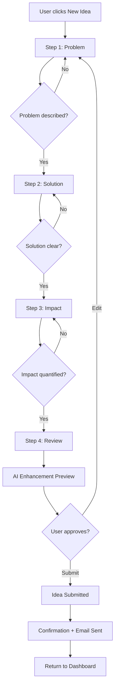
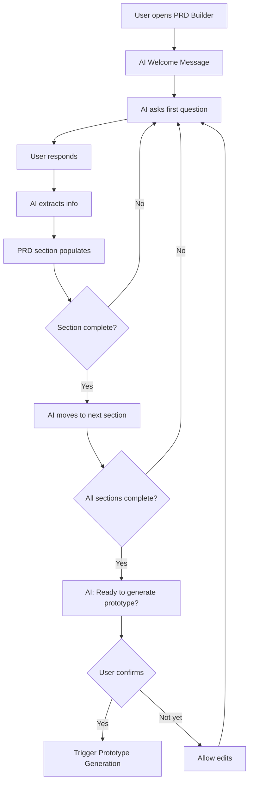
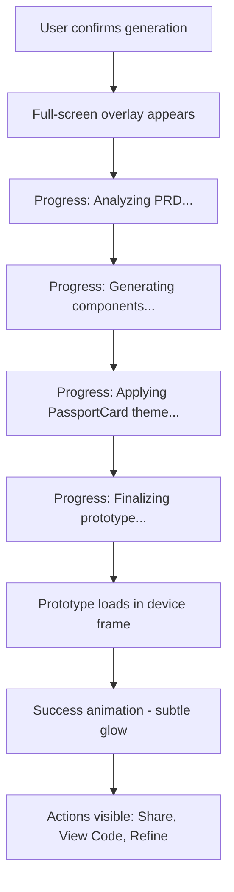
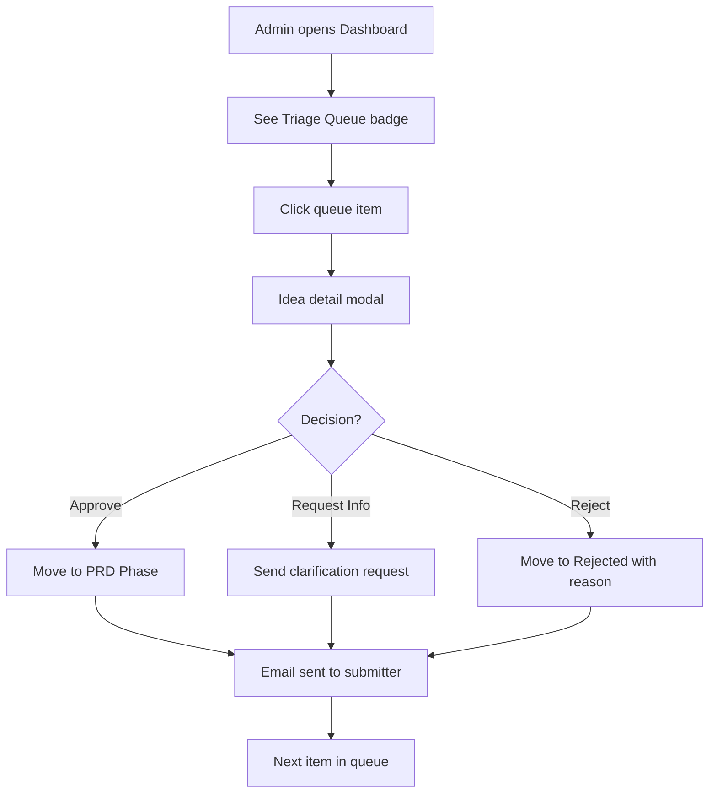
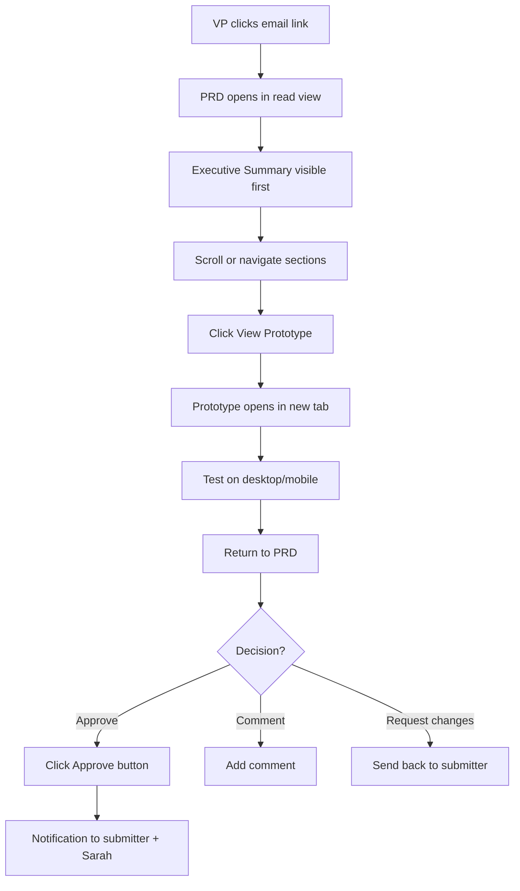

# UX Design Specification - IdeaSpark

**Author:** Ben.akiva
**Date:** 2026-01-11

---

## Executive Summary

### Project Vision

IdeaSpark transforms PassportCard's innovation culture by solving the "idea credibility gap." The platform empowers employees across all skill levels to transform vague ideas into professional, branded proposals through a guided three-phase workflow: Idea Submission → AI-Assisted PRD Development → Auto-Generated Prototype. By combining conversational AI guidance (Gemini 2.5 Flash) with instant React prototyping (open-lovable) in PassportCard's exact design language (DaisyUI + #E10514 brand red), employees gain both autonomy and credibility. Success means ideas arrive complete with structured requirements and tangible visual proof—transforming leadership evaluation from "sounds interesting" to "let's implement this."

**Core User Value:** Turn your idea into a working prototype in days, not weeks of meetings.

### Target Users

**Primary Users - Idea Creators (Employees)**

**Maya - The Frontline Innovator**
- Role: Customer Service Representative, 3 years at PassportCard
- Pain Point: Ideas disappear into a "black hole"—suggestions ignored despite seeing customer problems daily
- Success Vision: Transform observations into professional PRDs + branded prototypes independently, earning recognition
- Key Need: Autonomy + Credibility (tools that make ideas look professional without technical skills)
- Aha Moment: "This looks like it already belongs in our product"

**David - The Technical Problem Solver**
- Role: Backend Developer, 5 years at PassportCard
- Pain Point: Identifies improvements but has no bandwidth to prototype; ideas die in notes
- Success Vision: Convert technical concepts into structured PRDs + working prototypes without leaving development work
- Key Need: Speed + Autonomy (rapid idea exploration without approval overhead)
- Aha Moment: Seeing technical concept visualized without writing code

**Rachel - The Strategic Visionary**
- Role: Product Manager, Insurance Products Division
- Pain Point: Articulates opportunities well but can't demonstrate solutions visually; PowerPoint mockups lack credibility
- Success Vision: Transform strategic insights into PassportCard-branded prototypes that secure executive buy-in
- Key Need: Credibility + Professional Polish (demos that look production-ready, not generic)
- Aha Moment: Prototype looks like something that could ship immediately

**Secondary Users - Innovation Gatekeepers & Decision Makers**

**Sarah - Innovation Manager**
- Role: Manages idea triage, assigns reviewers, tracks submission pipeline
- Pain Point: Innovation program is chaotic—ideas tracked across emails/Slack with no visibility
- Success Vision: Structured pipeline with clear metrics and efficient workflow management
- Key Need: Pipeline visibility, workflow efficiency, measurable innovation metrics
- Aha Moment: Showing executives real innovation metrics for the first time

**Executive Decision Makers (VPs, Department Heads)**
- Role: Approve projects, allocate budgets, set strategic direction
- Pain Point: Vague pitches require multiple exploratory meetings with unclear feasibility
- Success Vision: Make informed decisions in 15 minutes with complete packages (PRD + prototype)
- Key Need: Rapid evaluation capability, tangible proof of concept, clear implementation path
- Aha Moment: Clicking working prototype and thinking "This could ship"

### Key Design Challenges

**1. Progressive Complexity Balance**
- Must feel simple for non-technical users (Maya) yet powerful for technical users (David)
- Conversational AI needs to guide without feeling patronizing or robotic
- PRD structure must emerge naturally without overwhelming users who've never written requirements
- Challenge: How do we make sophisticated product management accessible to everyone?

**2. Trust & Credibility Building**
- Generated PRDs must look professional immediately—no "AI-generated feel"
- Prototypes must be indistinguishable from real PassportCard products (perfect brand compliance)
- Every interaction must reinforce "this is real, this is credible, this is taken seriously"
- Challenge: How do we design trust into every step of the journey?

**3. Multi-User Type Experience Design**
- Employees need autonomy, encouragement, and guidance
- Innovation Managers need efficiency, pipeline visibility, and workflow control
- Executives need rapid evaluation, clear decision support, and confidence in approvals
- Each experience is distinct but interconnected through shared data
- Challenge: How do we serve fundamentally different needs in one cohesive platform?

**4. AI Interaction Patterns**
- Conversational PRD building must feel collaborative, not interrogative
- AI enhancements must be transparent (show what changed and why)
- Chat-based prototype refinement must maintain strict brand consistency
- Users need to feel in control, not automated
- Challenge: How do we design AI interactions that empower rather than alienate?

### Design Opportunities

**1. Emotional Journey Transformation**
- Transform user emotional state: "my ideas are ignored" → "I'm a recognized contributor"
- Celebrate progress with professional acknowledgment (no childish gamification)
- Build confidence through progressive disclosure and smart AI guidance
- Create moments of delight when users see their ideas come to life
- Opportunity: Design an experience that makes employees feel valued and empowered

**2. Brand Consistency as Competitive Differentiator**
- DaisyUI + Pasportcard DSM (#E10514 red, 20px radius, Montserrat/Rubik fonts) = instant credibility
- Every generated prototype looks "production-ready" from second one
- Visual consistency creates trust in the platform and the ideas it produces
- Opportunity: Make brand perfection effortless—it "just works"

**3. Speed as a Core Feature**
- "5 days from idea to approval" journey must feel fast at every step
- Real-time feedback, instant prototype generation (< 30 seconds), live PRD building
- Progress visibility reduces anxiety: "your idea is moving forward"
- Opportunity: Design speed into every interaction—eliminate waiting, uncertainty, friction

**4. Data Visualization Excellence**
- Analytics dashboard that tells the innovation story visually
- Pipeline visualization that empowers managers with clear workflow visibility
- Metrics that prove platform value to executives (approval rates, time-to-decision, ROI)
- Opportunity: Make innovation measurable and visible for the first time

## Core User Experience

### Defining Experience

IdeaSpark's core experience centers on two primary user actions that define the platform's value:

**1. Submitting Ideas** - The entry point where employees transform vague thoughts into structured, professional proposals through a guided 4-step wizard with AI enhancement. This is where credibility begins.

**2. Building PRDs with AI** - The heart of the platform where conversational AI guides users through creating comprehensive Product Requirements Documents. This is where empowerment happens—non-technical users create professional specifications that would normally require product management expertise.

**The Ultimate Aha Moment:**
The moment a user completes their AI-built PRD and sees it transform into a working, PassportCard-branded React prototype in 30 seconds. This is the "holy shit" moment where users realize: *"This looks like it already belongs in our product."* Everything in the UX is designed to accelerate users toward this transformative experience.

**Core User Loop:**
Submit Idea → AI Enhances → Build PRD Conversationally → Generate Branded Prototype → Refine → Share with Leadership → Recognition

### Platform Strategy

**Primary Platform: Web Application**
- React-based responsive web application
- Accessed via standard browsers (Chrome, Firefox, Safari, Edge - latest 2 versions)
- Cloud-hosted on Supabase infrastructure
- No native mobile apps required for MVP

**Multi-Device Experience:**
- **Desktop-First Design** for heavy-duty work
  - PRD development with conversational AI (requires focus and typing)
  - Prototype review and detailed evaluation
  - Admin dashboard and analytics visualization
  - Primary interaction: Mouse/keyboard

- **Mobile-Responsive** for lightweight interactions
  - Quick idea submission during inspiration moments
  - Status checking and notifications
  - Prototype sharing with colleagues
  - Quick reviews and approvals
  - Primary interaction: Touch-friendly, thumb-zone optimized

**Real-Time Capabilities:**
- Auto-save during PRD development (eliminate fear of losing work)
- Live PRD building (users see structure emerge as they answer AI questions)
- Admin dashboard updates in real-time (pipeline changes reflect immediately)
- Prototype generation progress indicators (visible status, reduce anxiety)

**Performance Requirements:**
- Page load: < 3 seconds on standard broadband
- AI responses: 3-5 seconds (idea enhancement, PRD questions)
- Prototype generation: < 30 seconds (critical to maintain momentum)
- User interactions: < 100ms responsiveness (clicks, typing, navigation)

**No Offline Functionality Required:**
- Always-connected experience (cloud-based collaboration)
- Real-time sync with backend
- Immediate access to AI services

### Effortless Interactions

**1. Brand Consistency (Completely Automatic)**
- Every generated prototype uses PassportCard DaisyUI theme (#E10514 red, 20px radius, Montserrat/Rubik fonts)
- Users cannot break the brand—it's enforced at the system level
- Prototypes look production-ready from second one, zero design effort required
- Result: Users trust the output will always look professional

**2. AI Guidance (Natural and Adaptive)**
- Conversational PRD building feels like chatting with a helpful product manager colleague
- Questions adapt to user sophistication (simplified for Maya, technical depth for David)
- AI enhancement shows what changed and why (transparency builds trust)
- No robotic interrogation—natural dialogue that empowers rather than alienates
- Result: Users feel guided, not controlled; capable, not overwhelmed

**3. Prototype Generation (Just Works)**
- Mark PRD complete → Prototype appears in 30 seconds
- No configuration, no setup, no design decisions needed
- Chat-based refinement maintains brand consistency automatically
- Shareable URLs work immediately, no permissions hassle
- Result: Magic happens without user thinking about it

**4. Progress Tracking (Always Visible, Zero Anxiety)**
- Auto-save eliminates "did I lose my work?" fear
- Status always visible (submitted, PRD development, prototype complete)
- Progress indicators during long operations (prototype generation)
- Clear next steps at every stage
- Result: Users always know where they are and what happens next

**5. Idea Submission (Fast and Encouraging)**
- 4-step wizard guides without overwhelming
- AI enhancement provides immediate positive feedback
- Takes minutes, not hours
- Confirmation reinforces "your idea was captured properly"
- Result: Submitting ideas feels easy and rewarding, not daunting

### Critical Success Moments

**For Maya (Non-Technical Primary User):**

**First Success Moment: AI Enhancement Validation**
- Moment: Maya submits rough idea → AI enhances it into clear, professional language
- Emotion: "Wow, I sound professional"
- UX Requirement: AI enhancement must be obviously better while preserving her voice
- Impact: Builds confidence to continue to PRD phase

**Main Success Moment: The Prototype Reveal**
- Moment: Completes conversational PRD → Branded prototype appears in 30 seconds
- Emotion: "This looks like it already belongs in our product" (THE AHA MOMENT)
- UX Requirement: Prototype must be indistinguishable from real PassportCard products
- Impact: Transforms belief from "maybe my idea is good" to "this should be built"

**Validation Success Moment: Leadership Takes Her Seriously**
- Moment: Shares prototype with manager → Gets meeting scheduled, idea discussed seriously
- Emotion: "My ideas matter"
- UX Requirement: Shareable URLs work flawlessly, prototypes impress on first view
- Impact: Long-term engagement, becomes repeat contributor

**For David (Technical Primary User):**

**First Success Moment: Technical Translation**
- Moment: Submits technical concept → AI structures it clearly for non-technical reviewers
- Emotion: "This bridges the gap between tech and business"
- UX Requirement: AI understands technical depth while making it accessible
- Impact: Confidence that technical ideas will be understood by leadership

**Main Success Moment: Visualization Without Code**
- Moment: Technical PRD complete → Prototype visualizes concept without writing code
- Emotion: "I just saved weeks of prototyping work"
- UX Requirement: Prototype captures technical concept accurately in visual form
- Impact: David can explore multiple ideas without bandwidth constraints

**For Sarah (Innovation Manager - Admin):**

**First Success Moment: Pipeline Visibility**
- Moment: Opens dashboard → Sees entire innovation pipeline organized and measurable
- Emotion: "Finally, I can actually manage this chaos"
- UX Requirement: Dashboard must show status at a glance, actionable items clear
- Impact: Shifts from reactive (answering emails) to proactive (pipeline management)

**Main Success Moment: Innovation Metrics Visibility**
- Moment: Reviews analytics → Shows executives real innovation metrics for first time
- Emotion: "Innovation is now measurable and visible"
- UX Requirement: Analytics must tell compelling story with clear visualizations
- Impact: Innovation program gains credibility and strategic importance

**For Executives (Decision Makers):**

**Success Moment: Rapid Informed Decision**
- Moment: Clicks idea link → Reviews PRD and working prototype in 15 minutes → Makes decision
- Emotion: "This could ship—I have everything I need to decide"
- UX Requirement: PRD + prototype combination provides complete evaluation package
- Impact: Faster decisions, more ideas approved, visible innovation ROI

### Experience Principles

**Principle 1: Progressive Empowerment**
- Start simple (idea submission feels easy and approachable)
- Progressively reveal sophistication (PRD building feels powerful without overwhelming)
- AI guides without patronizing—adapts to user capability
- Users feel more capable at each step, never intimidated by complexity
- Application: UI complexity scales with user engagement—new users see simplicity, power users access depth

**Principle 2: Instant Credibility**
- Every output looks professional immediately (AI-enhanced ideas, structured PRDs, branded prototypes)
- Brand consistency is automatic and perfect—users never worry about "looking amateur"
- The platform makes users look good to leadership
- Application: Zero tolerance for outputs that feel "AI-generated" or generic—everything must pass as professionally crafted

**Principle 3: Effortless Excellence**
- Brand consistency: Happens automatically, users can't break it
- AI guidance: Feels conversational and natural, adapts to user sophistication
- Prototype generation: Just works—30 seconds to "wow"
- Progress tracking: Always visible, auto-save eliminates anxiety
- Application: Remove every possible point of friction—if users have to think about it, we failed

**Principle 4: Aha Moment Design**
- The core experience centers on: "This looks like it already belongs in our product"
- Speed to this moment is critical—reduce friction at every step
- First-time success is mandatory—new users must hit the aha moment on first try
- Application: Optimize every interaction for time-to-wow, measure success by how fast users reach the prototype reveal

**Principle 5: Multi-Level Intelligence**
- Platform serves non-technical Maya and technical David equally well
- AI adapts depth based on user responses (smart but not condescending)
- Managers get pipeline intelligence, Executives get decision intelligence
- Application: Design one interface that intelligently adapts, not multiple dumbed-down versions

## Desired Emotional Response

### Primary Emotional Goals

**Core Emotional Transformation:**
IdeaSpark's emotional design centers on a fundamental state change: transforming employees from feeling powerless and ignored ("my ideas disappear into a black hole") to feeling empowered and valued ("I'm a recognized contributor"). Every interaction must reinforce this transformation.

**Primary Emotional Goal: Empowered Credibility**
- Users feel **capable** - "I can create professional PRDs without technical skills"
- Users feel **taken seriously** - "My outputs look professional, leadership listens"
- Users feel **confident** - "The AI makes me feel smart, not inadequate"
- Users feel **accomplished** - "I went from idea to prototype in days, not weeks"
- Users feel **validated** - "My contributions matter and are recognized"

**The Defining Emotional Moment:**
The moment of **delighted surprise** when the branded prototype appears in 30 seconds and users think: "This looks like it already belongs in our product." This "holy shit, I just did that" feeling is what makes users tell colleagues and become repeat contributors.

**Differentiating Emotional Quality: Professional Credibility**
Unlike generic prototyping tools that create outputs users must apologize for or heavily explain, IdeaSpark makes users feel **professionally proud**. The emotion isn't "I made something," it's "I made something that looks like it could ship tomorrow." This professional pride transforms how users see themselves within the organization.

### Emotional Journey Mapping

**Stage 1: First Discovery (Marketing/Email Announcement)**
- **Emotion:** Skeptical curiosity
- **Internal Dialogue:** "Interesting concept, but does it really work? This sounds too good to be true."
- **Design Goal:** Create intrigue without overpromising; show real examples, not vague promises
- **Success Indicator:** User clicks through to try it

**Stage 2: Idea Submission (First Interaction)**
- **Emotion:** Encouraged optimism
- **Internal Dialogue:** "This is easier than I thought. The questions make sense."
- **Design Goal:** Lower anxiety immediately, build confidence through clear guidance
- **Success Indicator:** User completes submission without abandoning

**Stage 3: AI Enhancement Reveal**
- **Emotion:** Validated capability
- **Internal Dialogue:** "Wow, I sound professional! This improved my idea while keeping my voice."
- **Design Goal:** First proof that the platform makes users look good
- **Success Indicator:** User trusts the AI and continues to PRD phase

**Stage 4: PRD Building (Core Experience)**
- **Emotion:** Guided collaboration
- **Internal Dialogue:** "I'm creating something real. The AI feels like a helpful colleague, not a robot."
- **Design Goal:** Feel like a collaborator building something together, not a user being interrogated
- **Success Indicator:** User spends 45+ minutes engaged without frustration

**Stage 5: Prototype Generation (The Aha Moment)**
- **Emotion:** Delighted amazement
- **Internal Dialogue:** "Holy shit! This looks like it already belongs in our product. I can't believe I just created this."
- **Design Goal:** Blow minds with brand-perfect output that exceeds expectations
- **Success Indicator:** User immediately shares with colleagues or leadership

**Stage 6: Sharing with Leadership**
- **Emotion:** Confident pride
- **Internal Dialogue:** "I'm presenting something credible. I feel prepared, not nervous."
- **Design Goal:** Transform user from anxious to professionally confident
- **Success Indicator:** User schedules meetings, shares links without hesitation

**Stage 7: Approval/Recognition**
- **Emotion:** Valued empowerment
- **Internal Dialogue:** "My ideas matter here. I can actually make an impact."
- **Design Goal:** Create long-term engagement, transform into repeat contributor
- **Success Indicator:** User submits additional ideas within 30 days

**Error/Failure State: If Something Goes Wrong**
- **Emotion:** Reassured, not panicked
- **Internal Dialogue:** "The system has my back. My work is safe. I know what to do next."
- **Design Goal:** Build trust through auto-save, clear error messages, easy recovery
- **Success Indicator:** User continues despite setback, doesn't abandon platform

**Returning User:**
- **Emotion:** Familiar confidence
- **Internal Dialogue:** "I know this works. I'm excited to build my next idea."
- **Design Goal:** Reduce friction even further, leverage previous success
- **Success Indicator:** Faster completion time, increased sophistication in ideas

### Micro-Emotions

**1. Confidence vs. Confusion**
- **Critical Moment:** When AI asks PRD questions
- **Target State:** Confident - "I know how to answer this, the question makes sense"
- **State to Avoid:** Confused - "I don't understand what they're asking for"
- **Design Requirement:** Questions must be conversational, clear, with examples and context
- **Failure Mode:** Vague or overly technical questions that intimidate non-technical users
- **Success Indicator:** Users answer questions without hesitation or re-reading multiple times

**2. Trust vs. Skepticism**
- **Critical Moment:** When AI enhances ideas or generates PRD content
- **Target State:** Trust - "The AI improved this, I can see why, it preserved my intent"
- **State to Avoid:** Skepticism - "Did the AI understand me? This feels generic or wrong"
- **Design Requirement:** Show before/after comparisons, transparent AI changes, preserve user voice
- **Failure Mode:** AI changes feel opaque or strip away user's unique perspective
- **Success Indicator:** Users accept AI suggestions without heavy editing

**3. Excitement vs. Anxiety**
- **Critical Moment:** Waiting for prototype generation (30-second window)
- **Target State:** Excited anticipation - "This is going to be amazing, I can't wait to see it"
- **State to Avoid:** Anxiety - "Is it working? What if it fails? This is taking forever"
- **Design Requirement:** Engaging progress indicators, positive messaging, visible activity
- **Failure Mode:** Blank loading screen, unclear status, no indication of progress
- **Success Indicator:** Users watch the progress indicator with anticipation, not worry

**4. Accomplishment vs. Frustration**
- **Critical Moment:** Throughout the PRD building process (45-minute journey)
- **Target State:** Progressive accomplishment - "Look how much I've built, I'm making real progress"
- **State to Avoid:** Frustration - "This is taking forever, am I even making progress? Will I ever finish?"
- **Design Requirement:** Visual progress tracking, section completion indicators, auto-save confirmations
- **Failure Mode:** No sense of progress, unclear how much remains, fear of losing work
- **Success Indicator:** Users continue through entire PRD without abandoning mid-process

**5. Delight vs. Satisfaction**
- **Critical Moment:** The prototype reveal (the aha moment)
- **Target State:** Delighted surprise - "Holy shit, this is amazing! This looks real!"
- **State to Avoid:** Mere satisfaction - "Yeah, it's fine, basically what I expected"
- **Design Requirement:** Smooth reveal animation, perfect brand match creates wow factor
- **Failure Mode:** Generic-looking prototype, broken brand consistency, bugs on first view
- **Success Indicator:** Users say "wow" out loud, immediately show someone else

**6. Belonging vs. Isolation**
- **Critical Moment:** After submitting ideas and waiting for feedback
- **Target State:** Belonging - "I'm part of the innovation culture, my voice is heard"
- **State to Avoid:** Isolation - "My idea went into a black hole again, no one cares"
- **Design Requirement:** Clear status visibility, acknowledgment messages, notification of next steps
- **Failure Mode:** Silent submission, no confirmation, unclear what happens next
- **Success Indicator:** Users feel connected to innovation process, not abandoned

### Design Implications

**Empowerment → Progressive Disclosure Architecture**
- Start with simple 4-step wizard (problem, solution, impact, review)
- Progressively reveal sophistication during PRD building (AI adapts depth)
- Advanced features appear as users demonstrate capability
- UI complexity scales with user engagement—new users see simplicity, experienced users access depth
- Never overwhelm; always make users feel more capable at each step
- **Implementation:** Adaptive AI questioning, collapsible advanced sections, contextual help

**Credibility → Automatic Brand Perfection**
- DaisyUI theme with Pasportcard DSM locked and enforced at system level
- Every generated prototype uses #E10514 red, 20px radius, Montserrat/Rubik fonts automatically
- Users cannot break brand consistency—it's impossible by design
- Zero tolerance for generic or amateur aesthetics in any output
- Professional polish applied automatically to all AI-generated content
- **Implementation:** Theme enforcement in prototype generator, brand validation checks, design system as default

**Trust → Radical Transparency**
- Show what AI changed and why (side-by-side before/after for enhancements)
- Auto-save visible and confirmed ("Saved 2 seconds ago" always visible)
- Clear error messages with specific recovery paths, never vague failures
- Status always visible (submitted, in review, PRD building, prototype generating)
- AI reasoning exposed when requested ("Why did you ask this question?")
- **Implementation:** Transparent AI changes UI, persistent save status, detailed error states, visible processing

**Accomplishment → Visible Progress Architecture**
- PRD sections visually fill as user answers questions (live structure building)
- Progress indicators throughout journey (idea submission 25% → PRD 75% → prototype 100%)
- Milestone celebrations at key completions (professional acknowledgment, not childish badges)
- Section completion checkmarks provide visual sense of progress
- "You've completed X of Y sections" reinforcement
- **Implementation:** Real-time PRD preview, progress bars, completion indicators, subtle success animations

**Delight → The 30-Second Wow Experience**
- Smooth prototype reveal with elegant animation (not jarring instant load)
- Brand-perfect output exceeds expectations on first view
- Prototype works immediately—responsive, functional, shareable with zero setup
- "Preview your prototype" button creates anticipation before reveal
- Success state celebrates moment without being childish
- **Implementation:** Smooth fade-in animation, prototype preview modal, instant shareable URL generation

**Confidence → Conversational Intelligence**
- AI questions feel like chatting with helpful product manager colleague
- Questions include examples and context ("For example: reduce support calls by 30%")
- Adaptive depth based on user responses (technical users get technical depth)
- Never robotic or interrogative—natural dialogue that empowers
- Users can ask AI to clarify or rephrase questions
- **Implementation:** Conversational AI prompt design, contextual examples, follow-up capability, adaptive questioning

### Emotional Design Principles

**Principle 1: Design for the Aha Moment**
Every UX decision must optimize for the speed and power of the emotional transformation when users see their branded prototype for the first time. This moment defines success.

**Application:**
- Minimize friction before the aha moment (fast idea submission, smooth PRD building)
- Maximize impact at the aha moment (perfect brand match, smooth reveal animation)
- Leverage momentum after the aha moment (immediate sharing, easy refinement)
- Measure success by time-to-aha-moment and emotional intensity of reaction

**Principle 2: Progressive Empowerment Over Simplification**
Don't dumb down the platform for non-technical users. Instead, progressively empower them to create sophisticated outputs through intelligent guidance.

**Application:**
- AI adapts to user capability, never condescends
- Advanced features reveal as users demonstrate readiness
- Professional outputs regardless of user technical skill
- Users feel more capable after each interaction, never limited

**Principle 3: Transparency Builds Trust**
Every AI decision, every system action, every status change must be visible and explainable. Opacity creates anxiety; transparency creates confidence.

**Application:**
- Show AI reasoning and changes
- Make auto-save and system state always visible
- Provide clear error messages with recovery paths
- Status is never ambiguous or hidden

**Principle 4: Celebrate Progress, Not Points**
Acknowledge user accomplishments professionally and meaningfully. Avoid childish gamification (points, badges, leaderboards) that undermines professional credibility.

**Application:**
- Subtle animations at milestone completions
- Professional acknowledgment messages
- Recognition visible to leadership (contributor highlights)
- Success reinforcement without juvenile elements

**Principle 5: Speed is an Emotional Multiplier**
Fast responses amplify positive emotions; delays amplify anxiety. Speed to prototype reveal, AI response time, and page load performance are emotional design variables, not just technical requirements.

**Application:**
- AI responses < 5 seconds (maintain conversation flow)
- Prototype generation < 30 seconds (sustain excitement, prevent anxiety)
- Page loads < 3 seconds (maintain momentum)
- Every delay must have engaging progress indication

## UX Pattern Analysis & Inspiration

### Inspiring Products Analysis

IdeaSpark draws UX inspiration from best-in-class products that excel in speed, clarity, and user empowerment. The primary design language is inspired by **Linear**, with additional patterns from ChatGPT, Mixpanel, and Slack.

**Primary Design Template: Linear**

IdeaSpark adopts Linear's UI/UX as its foundational design language, adapting it for innovation management while maintaining Pasportcard brand identity.

**Why Linear:**
- Exceptional speed and performance (instant UI, optimistic updates)
- Clean, professional aesthetic that builds credibility
- Progressive disclosure without overwhelming users
- Beautiful empty states that guide first-time users
- Keyboard shortcuts for power users
- Smooth, purposeful animations
- Modern design that feels current and trustworthy

**Linear's Core UX Principles Applied to IdeaSpark:**
- **Speed as a Feature** - Every interaction feels instant
- **Keyboard-First** - Power users can navigate without mouse
- **Context Awareness** - UI adapts to what user is doing
- **Visual Clarity** - Information hierarchy is immediately clear
- **Delightful Details** - Smooth animations, thoughtful micro-interactions

**Adapting Linear for IdeaSpark:**
- Linear's layout structure → IdeaSpark's navigation
- Linear's interaction patterns → IdeaSpark's workflows
- Linear's signature purple → Pasportcard's #E10514 red
- Linear's Inter font → Pasportcard's Montserrat/Rubik
- Linear's border radius → Pasportcard's 20px standard

**Result:** IdeaSpark feels like Linear (familiar, fast, professional) while looking distinctly Pasportcard (brand colors, fonts, design system).

---

**1. Linear - Issue Tracking with Beautiful, Fast UX**

**Core Strengths:**
- **Speed as Emotional Design:** Instant navigation, zero loading states, keyboard shortcuts everywhere
- **Visual Excellence:** Clean minimalist interface, generous white space, smooth purposeful animations
- **Progressive Disclosure:** Simple by default, powerful when needed, inline editing everywhere
- **Delightful Empty States:** Beautiful guidance when no content exists yet

**What Makes Users Love Linear:**
- Faster than alternatives (Jira, Azure DevOps)
- Beautiful UI makes work feel less tedious
- Keyboard shortcuts make power users efficient
- Consistent experience across platforms

**UX Patterns to Apply:**
- Optimistic UI updates (auto-save feels instant, no anxiety)
- Command palette (Cmd+K) for quick navigation to any idea/PRD/prototype
- Contextual actions on hover (edit, share, delete appear only when needed)
- Beautiful empty states ("No ideas yet? Here's how to get started")
- Sidebar navigation with visual status indicators

---

**2. ChatGPT - Conversational AI That Feels Natural**

**Core Strengths:**
- **Natural Conversation Flow:** Simple chat interface, familiar mental model, clear message history
- **Transparency & Control:** Regenerate responses, edit previous messages, stop generation button
- **User Empowerment:** Users feel smart, AI adapts to sophistication, collaborative not interrogative
- **Error Handling:** Clear error messages, retry mechanism, doesn't lose context

**What Makes Users Love ChatGPT:**
- Feels collaborative, not robotic
- Results are genuinely helpful
- Interface gets out of the way
- Fast enough to maintain conversational flow

**UX Patterns to Apply:**
- Conversational PRD building (IdeaSpark's AI assistant uses this exact pattern)
- Real-time typing indicators during AI responses (reduce anxiety)
- Regenerate/edit capability for AI outputs (user control)
- Clear "thinking" states for transparency
- Stop generation control for user autonomy
- Message history that's clear and scrollable

---

**3. Mixpanel - Clean Analytics Visualization**

**Core Strengths:**
- **Data Storytelling:** Charts tell clear stories, visual hierarchy guides attention, semantic colors
- **Accessible Complexity:** Complex analytics made approachable, intuitive filters, visual segmentation
- **Dashboard Design:** Card-based layout, smart defaults, mobile-responsive
- **Actionable Insights:** Data leads to clear next actions, real-time updates

**What Makes Users Love Mixpanel:**
- Turns raw data into actionable insights
- Beautiful visualizations make data engaging
- Fast enough for exploratory analysis
- Sharing with stakeholders is frictionless

**UX Patterns to Apply:**
- Sarah's admin dashboard uses this clarity level
- Visual pipeline (cards showing ideas in each stage: submitted, PRD, prototype, approved)
- Real-time metrics (submission counts, completion rates, time-to-decision)
- Semantic colors (green=on track, red=needs attention, blue=in progress)
- Filterable views (department, date range, status)
- Export/share capabilities for executive reporting

---

**4. Slack - Enterprise Communication Done Right**

**Core Strengths:**
- **Enterprise Yet Lightweight:** Fast despite feature-rich, smooth onboarding, powerful search
- **Threading & Organization:** Threaded conversations, reactions reduce noise, starred items
- **Notifications Done Right:** Granular controls, Do Not Disturb, custom settings per channel
- **Quick Actions:** Message formatting discoverable, slash commands, drag-drop file sharing

**What Makes Users Love Slack:**
- Reduces email overload effectively
- Fast and responsive across all devices
- Search finds anything instantly
- Feels modern compared to email

**UX Patterns to Apply:**
- Notification system for status changes (idea approved, PRD ready, prototype generated)
- Quick actions (approve/reject ideas inline without leaving context)
- Threading for idea discussions/comments (Post-MVP)
- Search across all ideas, PRDs, prototypes
- Mobile experience matches desktop quality

### Transferable UX Patterns

**Navigation & Information Architecture (Linear + Slack Patterns):**

**Command Palette (Cmd+K)** - Quick navigation for power users
- **Apply to:** Jump to any idea, PRD, or prototype instantly by name or number
- **User:** David uses this constantly, Maya discovers it later
- **Implementation:** Global keyboard shortcut, fuzzy search, recent items prioritized

**Sidebar Navigation with Status Indicators** - Clear organization with visual cues
- **Apply to:** Ideas organized by status (Submitted → PRD Development → Prototype → Approved)
- **User:** Sarah sees pipeline at a glance, employees track their submissions
- **Implementation:** Linear-style sidebar with counts per status, color-coded indicators

**Contextual Actions on Hover** - Advanced features don't clutter default view
- **Apply to:** Edit, duplicate, share, delete appear only when hovering over idea cards
- **User:** Clean interface for Maya, quick actions for David
- **Implementation:** Hover reveals action buttons, keyboard shortcuts also available

---

**Interaction Patterns (ChatGPT + Linear):**

**Conversational Interface** - Natural dialogue for complex workflows
- **Apply to:** IdeaSpark's AI PRD assistant (THE core innovation!)
- **User:** Maya builds PRD through natural conversation, David gets technical depth
- **Implementation:** ChatGPT-style chat interface, adaptive questioning, context retention

**Real-Time Typing Indicators** - Show AI is processing
- **Apply to:** Reduce anxiety during AI responses, maintain conversational flow
- **User:** All users see "AI is thinking..." with typing animation
- **Implementation:** Streaming responses, animated dots, progress indication

**Optimistic UI Updates** - Changes reflect instantly, sync in background
- **Apply to:** Auto-save feels immediate, status changes instant, no loading spinners
- **User:** Users never worry about losing work, feel confident system is responsive
- **Implementation:** Update UI immediately, sync to Supabase asynchronously, conflict resolution

**Regenerate/Edit Capability** - User control over AI outputs
- **Apply to:** If AI enhancement isn't right, regenerate or manually edit
- **User:** Users feel in control, not automated
- **Implementation:** "Regenerate" button, inline editing, version comparison

---

**Visual & Feedback Patterns (Linear + Mixpanel):**

**Beautiful Empty States** - Guide first-time users with helpful visuals
- **Apply to:** "No ideas yet? Here's how to get started" with visual guidance
- **User:** First-time users never face blank screens, always know next step
- **Implementation:** Illustrations + clear CTAs, contextual help, sample ideas

**Progress Visualization** - Visual journey mapping
- **Apply to:** Idea → PRD → Prototype progress shown as clear stages
- **User:** Users see how far they've come, what's next, feel accomplished
- **Implementation:** Linear progress bar, stage indicators, completion percentages

**Smooth, Purposeful Animations** - Everything meaningful, nothing gratuitous
- **Apply to:** Prototype reveal, status transitions, milestone completions
- **User:** Delight without distraction, professional polish
- **Implementation:** 150-300ms transitions, easing curves, meaningful motion

**Card-Based Dashboards** - Information chunking with visual hierarchy
- **Apply to:** Sarah's admin dashboard, ideas list, PRD sections
- **User:** Information is scannable, clickable, well-organized
- **Implementation:** DaisyUI cards with Pasportcard shadows, hover states

---

**Data Visualization Patterns (Mixpanel):**

**Semantic Color Usage** - Colors convey meaning instantly
- **Apply to:** Green=completed, Blue=in progress, Red=needs attention, Gray=draft
- **User:** Sarah scans dashboard and immediately understands status
- **Implementation:** Pasportcard DSM status colors, consistent throughout

**Real-Time Metric Updates** - Data refreshes as events happen
- **Apply to:** Admin dashboard shows live submission counts, completion rates
- **User:** Sarah sees innovation happening in real-time
- **Implementation:** Supabase real-time subscriptions, optimistic updates

**Filterable Views** - Quick data slicing
- **Apply to:** Filter ideas by department, date range, status, user
- **User:** Sarah triages efficiently, finds specific ideas quickly
- **Implementation:** Filter chips, saved views, URL state persistence

---

**Enterprise Patterns (Slack):**

**Granular Notification Controls** - Users control their experience
- **Apply to:** Opt-in notifications for status changes, mentions, approvals
- **User:** Stay informed without notification fatigue
- **Implementation:** Notification preferences, email digest options, mobile push

**Inline Quick Actions** - Decisions without context switching
- **Apply to:** Admin approve/reject idea for PRD phase without opening full view
- **User:** Sarah triages 5 ideas in under a minute
- **Implementation:** Hover actions, keyboard shortcuts, batch operations

**Powerful Search** - Find anything instantly
- **Apply to:** Search across all ideas, PRDs, prototypes by title, content, user
- **User:** David finds his technical idea from 2 months ago in 2 seconds
- **Implementation:** Full-text search, fuzzy matching, filters, recent items

**Mobile-Desktop Parity** - Same quality everywhere
- **Apply to:** Review prototypes on mobile, submit ideas on phone, full feature set
- **User:** Maya submits idea during lunch on her phone, reviews prototype on tablet
- **Implementation:** Fully responsive, touch-optimized, offline-first where possible

### Anti-Patterns to Avoid

**1. Jira's Complexity Overload**
- **Anti-Pattern:** Every feature visible at once, overwhelming interface with dozens of buttons and options
- **Why Harmful:** Maya would abandon immediately, feels intimidating and bureaucratic
- **Conflicts With:** Progressive empowerment principle, "start simple" approach
- **IdeaSpark Alternative:** Progressive disclosure, start with minimal UI, reveal depth as users engage

**2. Generic Form Builders**
- **Anti-Pattern:** Sterile checkbox-heavy forms that feel like government paperwork
- **Why Harmful:** Kills innovation excitement, makes idea submission feel like a chore
- **Conflicts With:** Emotional goal of empowerment and excitement
- **IdeaSpark Alternative:** Conversational flow, natural dialogue, feels like collaboration not paperwork

**3. Black Hole Submissions**
- **Anti-Pattern:** Submit form → complete silence → no idea what happens next, no status updates
- **Why Harmful:** This is literally the problem IdeaSpark solves! Reinforces "ideas are ignored"
- **Conflicts With:** Belonging vs. isolation micro-emotion, trust building
- **IdeaSpark Alternative:** Immediate confirmation, visible status always, proactive notifications

**4. Broken Mobile Experiences**
- **Anti-Pattern:** Desktop-only, or severely watered-down mobile version missing key features
- **Why Harmful:** Users need to review/share prototypes on mobile, submit ideas on the go
- **Conflicts With:** Modern user expectations, mobile-first workforce
- **IdeaSpark Alternative:** Fully responsive, mobile gets full features, touch-optimized, same quality everywhere

**5. Rigid Linear Workflows**
- **Anti-Pattern:** Can't edit after submission, can't skip steps, forced progression
- **Why Harmful:** Real innovation is messy and non-linear, needs flexibility
- **Conflicts With:** User empowerment, adaptive AI guidance
- **IdeaSpark Alternative:** Edit anytime, save progress, non-linear where appropriate, flexibility with structure

**6. Childish Gamification**
- **Anti-Pattern:** Points, badges, leaderboards, cartoon animations for professional work
- **Why Harmful:** Undermines professional credibility we're building, feels patronizing
- **Conflicts With:** Professional credibility emotional goal, "make users look good to leadership"
- **IdeaSpark Alternative:** Professional acknowledgment, leadership visibility, subtle success animations

**7. Robotic AI Interactions**
- **Anti-Pattern:** Formal technical language, rigid question-answer format, no personality
- **Why Harmful:** Creates distance, makes users feel inadequate or interrogated
- **Conflicts With:** Conversational AI principle, empowerment over intimidation
- **IdeaSpark Alternative:** Conversational tone, adaptive depth, collaborative dialogue, transparent reasoning

**8. Hidden System State**
- **Anti-Pattern:** No indication if work is saved, unclear if AI is processing, silent failures
- **Why Harmful:** Creates anxiety, users don't trust the system, fear losing work
- **Conflicts With:** Trust vs. skepticism micro-emotion, transparency principle
- **IdeaSpark Alternative:** Always-visible save status, clear processing indicators, explicit error messages with recovery

### Design Inspiration Strategy

**Primary Design Language: Linear-Inspired Foundation**

IdeaSpark adopts Linear's UI/UX as its core design template while integrating Pasportcard's brand identity (colors, fonts, design system) and incorporating best patterns from ChatGPT, Mixpanel, and Slack.

**Why Linear as Primary Template:**
- World-class UX recognized across tech industry
- Speed and performance align perfectly with IdeaSpark goals
- Progressive disclosure matches our empowerment strategy
- Clean professional aesthetic supports credibility goals
- Developers have clear reference ("build it like Linear")

**Implementation Approach: Linear Structure + Pasportcard Brand**
- **Layout:** Linear's sidebar navigation, card-based content, command palette
- **Interactions:** Linear's optimistic updates, keyboard shortcuts, hover states
- **Visual Design:** Pasportcard's #E10514 red, Montserrat/Rubik fonts, 20px radius
- **Components:** DaisyUI components styled with Pasportcard DSM
- **Result:** Feels like Linear, looks like Pasportcard

---

**What to Adopt Directly:**

**1. Linear's Complete UX Language → IdeaSpark's Foundation**
- **Adopt:** Layout structure, navigation patterns, keyboard shortcuts, speed optimizations
- **Rationale:** Proven excellence, familiar to tech users, saves design time
- **Implementation:** Use Linear as UX reference, developers build "Linear but Pasportcard-branded"
- **Adaptation:** Replace Linear purple with Pasportcard #E10514, Inter font with Montserrat

**2. ChatGPT's Conversational Interface → PRD Building Experience**
- **Adopt:** Chat UI, typing indicators, message history, regenerate capability
- **Rationale:** This IS our core innovation—conversational PRD building
- **Implementation:** Dedicated chat view for AI assistant, streaming responses, context retention
- **Adaptation:** Integrate with Linear-style layout (chat in main content, PRD preview in sidebar)

**3. Mixpanel's Dashboard Clarity → Admin Analytics**
- **Adopt:** Card-based metrics, semantic colors, real-time updates, filters
- **Rationale:** Sarah needs instant pipeline visibility and actionable insights
- **Implementation:** Admin dashboard page with metric cards, charts, filterable views
- **Adaptation:** Use Pasportcard colors for semantic meaning, simpler filters than Mixpanel

**4. Slack's Notification Design → Status Updates**
- **Adopt:** Granular notification controls, timely updates, mobile push
- **Rationale:** Keep users connected without overwhelming them
- **Implementation:** Notification preferences page, email digests, in-app notifications
- **Adaptation:** Fewer notification types than Slack, focus on critical status changes only

---

**What to Adapt for IdeaSpark:**

**1. Linear's Command Palette → Simplified Quick Nav**
- **Adapt:** Keep keyboard shortcut power, simplify for non-technical users
- **Change:** Fewer advanced options, clearer labels, contextual suggestions
- **Rationale:** David needs power, Maya needs simplicity
- **Implementation:** Cmd+K opens palette, shows recent items + common actions, progressive complexity

**2. ChatGPT's Regeneration → Enhanced AI Control**
- **Adapt:** Not just "regenerate," add "make more technical," "simplify this," "show alternatives"
- **Change:** More granular control over AI output style and depth
- **Rationale:** Different users need different sophistication levels
- **Implementation:** Dropdown with regeneration options, inline editing always available

**3. Mixpanel's Filtering → Focused Admin Filters**
- **Adapt:** Keep core filtering (department, status, date), skip advanced analytics
- **Change:** Simpler UI, fewer filter types, preset common views
- **Rationale:** Sarah needs triage efficiency, not deep data exploration
- **Implementation:** Filter chips at top of admin dashboard, 3-5 key filters max

**4. Slack's Threading → Simple Idea Comments (Post-MVP)**
- **Adapt:** Basic commenting on ideas/PRD sections, not full Slack threading complexity
- **Change:** Linear comments, no nested threads, simple @ mentions
- **Rationale:** Enable stakeholder feedback without feature bloat
- **Implementation:** Comment stream on idea detail page, notifications for mentions

---

**What to Avoid Completely:**

**1. Jira's Complexity** → Progressive Simplicity
- **Conflicts With:** Progressive empowerment, "start simple" approach
- **Instead:** Linear's clean interface, features revealed progressively

**2. Generic Forms** → Conversational Flows
- **Conflicts With:** Empowerment emotional goal, delight vs. frustration
- **Instead:** ChatGPT-style dialogue, guided conversation

**3. Silent Submissions** → Transparent Status
- **Conflicts With:** Belonging micro-emotion, trust building
- **Instead:** Immediate confirmation, always-visible status, proactive notifications

**4. Mobile Afterthoughts** → Mobile-First Quality
- **Conflicts With:** Modern expectations, mobile workforce
- **Instead:** Full responsive experience, touch-optimized, feature parity

**Design Implementation Roadmap:**

**Phase 1: Linear Foundation**
- Implement Linear-inspired layout and navigation
- Apply Pasportcard DSM (colors, fonts, spacing)
- Build core components with DaisyUI + custom theme

**Phase 2: ChatGPT Integration**
- Add conversational AI interface for PRD building
- Implement typing indicators, streaming responses
- Build regeneration and edit capabilities

**Phase 3: Dashboard & Analytics**
- Create Mixpanel-inspired admin dashboard
- Add real-time metrics and filters
- Implement data visualizations

**Phase 4: Notifications & Mobile**
- Add Slack-inspired notification system
- Optimize mobile experience
- Test and refine cross-device parity

This strategy provides clear direction: "Build IdeaSpark with Linear's UX, Pasportcard's brand, ChatGPT's conversational AI, Mixpanel's analytics clarity, and Slack's notification intelligence."

## Design System Foundation

### Design System Choice

**Primary System: DaisyUI + Pasportcard Design System Monorepo (DSM) Theming**

IdeaSpark uses a **themeable foundation approach** combining DaisyUI's component library with Pasportcard's complete design system, overlaid with Linear-inspired UX patterns.

**Technology Stack:**
- **Component Library:** DaisyUI (Tailwind CSS-based React components)
- **Brand Theme:** Pasportcard DSM (complete design tokens, colors, typography, spacing)
- **CSS Framework:** Tailwind CSS with custom Pasportcard theme configuration
- **UX Pattern Template:** Linear (layout, interactions, navigation patterns)
- **Implementation:** React + TypeScript + Supabase

**Why This Combination:**
This approach delivers the "best of three worlds":
1. **DaisyUI** provides pre-built, accessible components (buttons, cards, inputs, modals)
2. **Pasportcard DSM** ensures perfect brand consistency (#E10514 red, Montserrat/Rubik, 20px radius)
3. **Linear UX** guides layout structure and interaction patterns

**Result:** Developers build with proven components that automatically look like Pasportcard products, structured with Linear's excellent UX patterns.

### Rationale for Selection

**Decision Drivers:**

**1. Speed + Quality Balance**
- **Need:** MVP proof-of-concept with production-quality polish
- **Solution:** DaisyUI provides 50+ pre-built components (saves weeks of development)
- **Benefit:** Focus development time on innovation features (AI PRD, prototype generation), not building buttons

**2. Perfect Brand Consistency Requirement**
- **Need:** Every prototype must look exactly like Pasportcard products (credibility is critical)
- **Solution:** Pasportcard DSM theme enforced at system level via DaisyUI configuration
- **Benefit:** Developers cannot break brand—#E10514 red, 20px radius, Montserrat/Rubik applied automatically

**3. Existing Design Assets**
- **Asset:** Complete Pasportcard DSM with 1,600+ lines of specifications (SHAY's work)
- **Asset:** DaisyUI theme JSON ready to use (`dsm-tokens-for-ideaspark-daisyui.json`)
- **Asset:** CSS custom properties file ready to import (`dsm-tokens-for-ideaspark-css-variables.css`)
- **Benefit:** No design system creation needed—everything exists and is documented

**4. Technical Stack Alignment**
- **Stack:** React + TypeScript + Tailwind CSS + Supabase
- **Perfect Match:** DaisyUI is built for this exact stack
- **Integration:** Tailwind config imports Pasportcard theme, DaisyUI uses it automatically
- **Benefit:** Zero friction, standard tools, well-documented patterns

**5. Accessibility Built-In**
- **Requirement:** WCAG 2.2 Level AA + Israeli Standard 5568 compliance
- **Solution:** DaisyUI components are WCAG AA compliant by default
- **Enhancement:** Pasportcard DSM adds specific accessibility requirements (focus rings, contrast ratios)
- **Benefit:** Accessibility is automatic, not an afterthought

**6. Proven Component Quality**
- **Risk:** Custom components take time and often have bugs
- **Solution:** DaisyUI components are battle-tested across thousands of projects
- **Patterns:** Buttons, forms, modals, cards, navigation—all work perfectly
- **Benefit:** Higher quality than custom components, maintained by community

**7. Team Size Consideration**
- **Reality:** 1-2 developers building entire platform
- **Challenge:** Limited bandwidth for design system creation and maintenance
- **Solution:** DaisyUI handles component library, Pasportcard DSM handles branding
- **Benefit:** Small team achieves enterprise-quality results

**8. Linear UX Compatibility**
- **Inspiration:** Linear's layout and interaction patterns are the UX template
- **Implementation:** DaisyUI components can be arranged in Linear-style layouts
- **Customization:** Tailwind utilities enable Linear-inspired spacing, animations, hover states
- **Benefit:** Best UX patterns without rebuilding components from scratch

**Comparison to Alternatives:**

**Why Not Pure Custom Design System?**
- ❌ Would take 3-6 months to build component library
- ❌ 1-2 developer team doesn't have bandwidth
- ❌ Would delay MVP significantly
- ❌ Higher maintenance burden
- ✅ DaisyUI + DSM achieves same brand perfection faster

**Why Not Material Design or Ant Design?**
- ❌ Strong visual opinions conflict with Pasportcard brand
- ❌ Harder to theme comprehensively (#E10514 red everywhere, 20px radius everywhere)
- ❌ Don't integrate as cleanly with Tailwind CSS
- ✅ DaisyUI is built for Tailwind, themes naturally

**Why Not Headless UI (Radix, Headless UI)?**
- ❌ Headless systems require styling every component from scratch
- ❌ More work than DaisyUI's pre-styled components
- ❌ Still need to build visual design system
- ✅ DaisyUI provides styling + headless functionality where needed

**Why DaisyUI + Pasportcard DSM is Optimal:**
- ✅ Component library: Ready to use, high quality, accessible
- ✅ Brand theming: Perfect Pasportcard match via theme configuration
- ✅ Development speed: Fast without compromising quality
- ✅ Maintenance: Community maintains DaisyUI, team maintains theme
- ✅ Scalability: Easy to extend with custom components when needed
- ✅ Learning curve: Tailwind + React developers already know this pattern

### Implementation Approach

**Phase 1: Foundation Setup**

**1. Install Dependencies**
```bash
npm install daisyui@latest
npm install tailwindcss@latest
npm install @tailwindcss/typography
npm install @tailwindcss/forms
```

**2. Configure Tailwind + DaisyUI + Pasportcard Theme**

Import Pasportcard DaisyUI theme configuration (`dsm-tokens-for-ideaspark-daisyui.json`):

```javascript
// tailwind.config.js
module.exports = {
  content: ['./src/**/*.{html,js,jsx,ts,tsx}'],
  plugins: [
    require('daisyui'),
    require('@tailwindcss/typography'),
    require('@tailwindcss/forms'),
  ],
  daisyui: {
    themes: [
      {
        pasportcard: {
          // Import from dsm-tokens-for-ideaspark-daisyui.json
          'primary': '#E10514',
          'primary-focus': '#AD0F0F',
          'primary-content': '#FFFFFF',
          'secondary': '#1D1C1D',
          'accent': '#2246FC',
          'neutral': '#525355',
          'base-100': '#FFFFFF',
          'base-200': '#F5F4F2',
          'base-300': '#EEEDE9',
          'base-content': '#1D1C1D',
          'info': '#2246FC',
          'success': '#10B981',
          'warning': '#F59E0B',
          'error': '#AD0F0F',
          '--rounded-box': '1.25rem',
          '--rounded-btn': '1.25rem',
          '--rounded-badge': '99px',
          '--animation-btn': '0.15s',
          '--animation-input': '0.15s',
        },
      },
    ],
  },
  theme: {
    extend: {
      fontFamily: {
        'sans': ['Montserrat', 'system-ui', 'sans-serif'],
        'hebrew': ['Rubik', 'system-ui', 'sans-serif'],
        'mono': ['JetBrains Mono', 'monospace'],
      },
      fontSize: {
        'xs': '0.75rem',
        'sm': '0.875rem',
        'base': '1rem',
        'lg': '1.125rem',
        'xl': '1.25rem',
        '2xl': '1.5rem',
        '3xl': '1.625rem',
        '4xl': '2.5rem',
      },
      spacing: {
        // Pasportcard spacing scale
        '3xs': '0.125rem',
        '2xs': '0.1875rem',
        'xs-plus': '0.375rem',
        'sm-plus': '0.625rem',
      },
      boxShadow: {
        'card': '0px 4px 20px 0px rgba(29, 28, 29, 0.15)',
        'button-primary': '0px 6px 11px 0px rgba(225, 5, 20, 0.50)',
      },
    },
  },
};
```

**3. Import CSS Variables**

Import Pasportcard CSS custom properties globally:

```css
/* src/styles/global.css */
@import './dsm-tokens-for-ideaspark-css-variables.css';

@tailwind base;
@tailwind components;
@tailwind utilities;
```

**4. Set Theme on Root HTML**

```html
<!-- Apply Pasportcard theme globally -->
<html data-theme="pasportcard" lang="en">
```

**5. Import Google Fonts**

```html
<link rel="preconnect" href="https://fonts.googleapis.com">
<link rel="preconnect" href="https://fonts.gstatic.com" crossorigin>
<link href="https://fonts.googleapis.com/css2?family=Montserrat:wght@400;500;600;700&family=Rubik:wght@400;500;600;700&display=swap" rel="stylesheet">
```

---

**Phase 2: Component Usage**

**Using DaisyUI Components with Automatic Pasportcard Theming:**

```jsx
// Primary Button - automatically styled with #E10514 red
<button className="btn btn-primary">Submit Idea</button>

// Card - automatically styled with Pasportcard shadow and radius
<div className="card bg-base-100 shadow-card">
  <div className="card-body">
    <h2 className="card-title">Idea Title</h2>
    <p>Idea description...</p>
  </div>
</div>

// Input - automatically styled with 20px radius and Pasportcard colors
<input 
  type="text" 
  placeholder="Enter idea title" 
  className="input input-bordered w-full" 
/>

// Modal - automatically styled with Pasportcard theme
<dialog className="modal">
  <div className="modal-box">
    <h3 className="font-bold text-lg">PRD Complete!</h3>
    <p className="py-4">Your prototype is being generated...</p>
  </div>
</dialog>
```

**Benefit:** Every component automatically uses Pasportcard brand (colors, radius, shadows, spacing) without manual styling.

---

**Phase 3: Linear-Inspired Layout**

**Implement Linear's Layout Structure with DaisyUI Components:**

```jsx
// Linear-style sidebar navigation
<div className="drawer lg:drawer-open">
  <div className="drawer-side">
    <ul className="menu p-4 w-64 bg-base-100">
      <li><a>My Ideas</a></li>
      <li><a>PRDs</a></li>
      <li><a>Prototypes</a></li>
    </ul>
  </div>
  <div className="drawer-content">
    {/* Main content */}
  </div>
</div>

// Linear-style command palette
<dialog className="modal" id="command-palette">
  <div className="modal-box max-w-2xl">
    <input 
      type="text" 
      placeholder="Search ideas, PRDs, prototypes..." 
      className="input input-bordered w-full"
    />
  </div>
</dialog>
```

---

**Phase 4: Custom Components (When Needed)**

**Extend DaisyUI with Custom Components for IdeaSpark-Specific Needs:**

```jsx
// Custom: ChatGPT-style AI conversation interface
<div className="chat-container">
  <div className="chat chat-start">
    <div className="chat-bubble bg-base-200">AI question here...</div>
  </div>
  <div className="chat chat-end">
    <div className="chat-bubble bg-primary text-primary-content">
      User answer here...
    </div>
  </div>
</div>

// Custom: Prototype reveal animation
<div className="prototype-reveal animate-fade-in">
  <iframe src={prototypeUrl} className="rounded-box shadow-card" />
</div>
```

**Custom components inherit Pasportcard theme automatically** (colors, radius, spacing from CSS variables).

---

**Phase 5: Responsive Implementation**

**DaisyUI's Responsive Classes + Pasportcard Theme:**

```jsx
// Desktop: Sidebar + content
// Mobile: Drawer (hamburger menu)
<div className="drawer drawer-mobile">
  <input id="drawer" type="checkbox" className="drawer-toggle" />
  <div className="drawer-content flex flex-col">
    {/* Mobile: Hamburger menu */}
    <label htmlFor="drawer" className="btn btn-ghost lg:hidden">
      <svg>...</svg>
    </label>
    {/* Content */}
  </div>
  <div className="drawer-side">
    {/* Sidebar */}
  </div>
</div>
```

**Responsive breakpoints match Pasportcard DSM:**
- Mobile: 0px - 767px
- Tablet: 768px - 1023px
- Desktop: 1024px+

### Customization Strategy

**1. Theme Layer (Pasportcard DSM)**

**What:** Colors, typography, spacing, shadows, border radius  
**How:** Tailwind config imports Pasportcard DaisyUI theme JSON  
**Customization:** Already complete (SHAY provided all tokens)  
**Maintenance:** Update theme JSON when Pasportcard DSM changes  

**Component-Level Customization Examples:**

```javascript
// Override DaisyUI defaults with Pasportcard specifics
{
  '--rounded-box': '1.25rem',      // Pasportcard standard: 20px
  '--rounded-btn': '1.25rem',      // Buttons use same radius
  '--animation-btn': '0.15s',      // Fast transitions (Linear-inspired)
  'primary': '#E10514',            // Pasportcard brand red
  'base-100': '#FFFFFF',           // Pasportcard white
  'base-200': '#F5F4F2',           // Pasportcard secondary background
}
```

---

**2. Component Layer (DaisyUI + Custom)**

**DaisyUI Components (Use As-Is with Pasportcard Theme):**
- ✅ Buttons (btn, btn-primary, btn-secondary)
- ✅ Forms (input, textarea, select, checkbox, radio)
- ✅ Cards (card, card-body, card-title)
- ✅ Modals (modal, modal-box, modal-action)
- ✅ Navigation (navbar, drawer, menu)
- ✅ Feedback (alert, toast, progress)
- ✅ Layout (divider, stack, grid)

**Custom Components (IdeaSpark-Specific):**
- 🔧 AI Chat Interface (ChatGPT-style conversation)
- 🔧 PRD Builder (progressive disclosure sections)
- 🔧 Prototype Viewer (iframe with reveal animation)
- 🔧 Admin Pipeline Dashboard (Mixpanel-inspired metrics cards)
- 🔧 Status Indicators (idea workflow progress)
- 🔧 Command Palette (Linear-inspired Cmd+K search)

**Custom Component Strategy:**
- Build with DaisyUI base classes + Tailwind utilities
- Automatically inherit Pasportcard theme (colors, radius, spacing)
- Add IdeaSpark-specific behavior (AI streaming, prototype generation progress)
- Document custom components in shared component library

---

**3. Pattern Layer (Linear UX)**

**Layout Patterns:**
- Sidebar navigation (desktop) / Drawer (mobile)
- Command palette (Cmd+K quick navigation)
- Breadcrumb navigation
- Card-based content display

**Interaction Patterns:**
- Optimistic UI updates (instant feedback)
- Hover reveals contextual actions
- Keyboard shortcuts for power users
- Smooth animations (150-300ms transitions)

**Implementation:**
- Use Tailwind utilities for Linear-style spacing and layout
- Add custom CSS for Linear-specific animations
- Extend DaisyUI components with hover states and keyboard handlers

---

**4. Accessibility Layer (WCAG AA + Israeli Standard 5568)**

**DaisyUI Provides:**
- ✅ Semantic HTML (buttons, forms, dialogs)
- ✅ ARIA labels and roles
- ✅ Keyboard navigation
- ✅ Focus indicators

**Pasportcard DSM Adds:**
- ✅ 4.5:1 text contrast ratios (verified)
- ✅ 2px focus rings with 2px offset (black #1D1C1D)
- ✅ 44x44px minimum touch targets
- ✅ Reduced motion support (`prefers-reduced-motion`)

**Custom Components Must:**
- Maintain WCAG AA contrast ratios
- Include focus indicators (2px solid #1D1C1D with 2px offset)
- Support keyboard navigation
- Provide ARIA labels for screen readers
- Respect `prefers-reduced-motion`

**Validation:**
- Use axe DevTools for automated accessibility testing
- Manual keyboard navigation testing
- Screen reader testing (NVDA/JAWS)
- Color contrast verification (Contrast Checker)

---

**5. Maintenance Strategy**

**DaisyUI Updates:**
- **Frequency:** Check for updates quarterly
- **Process:** Test updates in staging, verify Pasportcard theme compatibility
- **Risk:** Low (theme configuration is stable)

**Pasportcard DSM Updates:**
- **Frequency:** As Pasportcard updates design system
- **Process:** Update theme JSON + CSS variables, test across all screens
- **Source:** Coordinate with SHAY (DSM agent) for latest tokens

**Custom Components:**
- **Documentation:** Storybook or component documentation site
- **Testing:** Unit tests + visual regression tests
- **Versioning:** Semantic versioning for component library

**Monitoring:**
- Visual regression tests (Percy, Chromatic)
- Accessibility audits (quarterly)
- Performance monitoring (Lighthouse CI)
- User feedback on design consistency

---

**Design System Documentation Structure:**

```
/docs/design-system/
  ├── README.md (overview)
  ├── getting-started.md (setup instructions)
  ├── theme-configuration.md (Pasportcard theme details)
  ├── components/
  │   ├── daisyui-components.md (how to use DaisyUI)
  │   └── custom-components.md (IdeaSpark-specific components)
  ├── patterns/
  │   ├── linear-layout.md (Linear-inspired patterns)
  │   └── responsive-design.md (breakpoints, mobile strategy)
  └── accessibility.md (WCAG compliance guide)
```

**Component Development Workflow:**

1. **Need New Component?** → Check if DaisyUI provides it
2. **DaisyUI Has It?** → Use with Pasportcard theme
3. **Need Customization?** → Extend DaisyUI component with Tailwind
4. **Truly Custom?** → Build with DaisyUI base + Tailwind + Pasportcard theme
5. **Document** → Add to component library docs
6. **Test** → Accessibility, responsiveness, visual regression
7. **Review** → Ensure Pasportcard brand consistency

This approach ensures every component—whether DaisyUI or custom—automatically looks and feels like Pasportcard while maintaining Linear's excellent UX patterns.

## Defining Core Experience

### The Two Defining Interactions

Every successful product has a defining experience - the core interaction that, if nailed, makes everything else follow. IdeaSpark has **two interconnected defining experiences** that work together to transform ideas into credible proposals.

**Defining Experience #1: Conversational PRD Building**
*"Chat with AI to build a professional PRD"*

- **What users tell friends:** "I just had a conversation with an AI, and it turned my rough idea into a complete product requirements document"
- **The magic moment:** When Maya (non-technical user) realizes she's building something professional without feeling overwhelmed
- **Why it's defining:** This is where empowerment happens—the transformation from "I have an idea" to "I have a professional spec"
- **User feeling:** "I can do this" → Confidence and capability

**Defining Experience #2: The Prototype Reveal**
*"See your idea become a branded prototype in 30 seconds"*

- **What users tell friends:** "I finished my PRD, clicked a button, and 30 seconds later I had a working prototype that looks exactly like our products"
- **The magic moment:** When the prototype appears in perfect Pasportcard branding (#E10514 red, proper fonts, 20px radius) and users think "This looks like it could ship tomorrow"
- **Why it's defining:** This is where credibility happens—the transformation from "maybe my idea is good" to "this should be built"
- **User feeling:** "This is real" → Delight and professional pride

**The Connected Journey:**
```
Conversational PRD Building → [Complete PRD] → Prototype Reveal → [Credible Proposal]
        ↓                                              ↓
   "I can do this"                               "This is real"
   (Empowerment)                              (Credibility)
```

Together, these experiences create the complete emotional transformation IdeaSpark promises: from ignored idea to recognized innovation contributor.

### User Mental Model

**How Users Currently Solve This Problem:**

**Informal Approach:**
- Email idea to manager or product team
- Idea gets buried in inbox
- Follow-ups feel like nagging
- No structure, no accountability
- **Outcome:** Ideas disappear into "black hole"

**Formal Approach:**
- Schedule meeting to pitch idea
- Weeks of calendar delays
- Vague verbal discussions without documentation
- Asked to "send something in writing"
- Cycle repeats
- **Outcome:** Idea stalls indefinitely

**DIY Documentation:**
- Write requirements in Word/Google Docs
- Lack structure (don't know what to include)
- Output looks unprofessional
- No visuals to support concept
- **Outcome:** Lacks credibility with leadership

**PowerPoint Mockups:**
- Create static slides with screenshots or shapes
- Time-consuming, looks generic
- Doesn't reflect Pasportcard brand
- Not interactive or functional
- **Outcome:** Dismissed as "not real"

**Mental Models Users Bring:**

**Maya (Non-Technical Employee):**
- **Belief:** "Writing requirements is for product managers, not me"
- **Fear:** "I don't know the right way to document this"
- **Expectation:** "If someone would just listen, they'd see this is a good idea"
- **Hope:** "Maybe if I had something visual to show, they'd get it"

**David (Technical Employee):**
- **Belief:** "I need to code a prototype to prove my idea works"
- **Fear:** "I don't have bandwidth to prototype while shipping features"
- **Expectation:** "Technical ideas die because business doesn't understand them"
- **Hope:** "If I could visualize this quickly, they'd approve it"

**Sarah (Innovation Manager):**
- **Belief:** "Innovation management means tracking emails and spreadsheets"
- **Fear:** "I'm missing good ideas because they're coming through chaos"
- **Expectation:** "Ideas need structure before leadership will consider them"
- **Hope:** "There must be a better way to capture and triage innovations"

**User Expectations for IdeaSpark:**

**Speed Expectation:**
- Should be faster than scheduling multiple meetings
- Should produce results in days, not weeks
- Should feel productive, not tedious

**Guidance Expectation:**
- Should help me know what to say and include
- Should ask the right questions
- Should not assume I'm a product manager

**Output Quality Expectation:**
- Should look professional enough to show leadership
- Should reflect Pasportcard brand (not generic)
- Should include both documentation and visuals

**Skill Level Expectation:**
- Should not require technical skills (coding, design)
- Should not require product management expertise
- Should guide me through the process

**What Users Love/Hate About Existing Solutions:**

**Love:**
- ✅ ChatGPT: Conversational, feels collaborative
- ✅ Google Docs: Easy to share, familiar
- ✅ PowerPoint: Visual, can show concepts
- ✅ Figma: Professional output, brand-consistent

**Hate:**
- ❌ Jira: Overwhelming, feels bureaucratic
- ❌ Email: Ideas get lost, no accountability
- ❌ Meetings: Slow, require scheduling overhead
- ❌ DIY Docs: Take too long, look unprofessional
- ❌ Generic tools: Don't reflect our brand

### Success Criteria

#### Defining Experience #1: Conversational PRD Building

**Users Say "This Just Works" When:**

✅ **Natural Conversation Flow**
- AI questions feel conversational, not robotic or interrogative
- Questions are clear and include examples
- User can answer in their own words, no forced format
- Conversation feels like talking to a helpful colleague

✅ **Real-Time Structure Emergence**
- Answers immediately appear as structured PRD content
- Users see PRD building in real-time (no black box)
- Professional formatting applied automatically
- Preview shows what leadership will see

✅ **Visible Progress**
- Clear indication of completion (3 of 7 sections done)
- Section checklist shows what's complete, what's next
- Progress bar at top (43% complete)
- Users always know how much remains

✅ **Zero Anxiety About Losing Work**
- Auto-save happens silently and continuously
- "Auto-saved" indicator visible but non-intrusive
- Can leave and return anytime, work preserved
- No "save" buttons to remember

✅ **Adaptive Depth**
- AI matches user sophistication automatically
- Maya gets simpler questions with more examples
- David gets technical depth and architecture discussions
- Same platform, different experiences

**Users Feel Smart/Accomplished When:**

✅ **AI Asks Questions They Can Answer**
- Questions align with what user knows
- Never feels stumped or inadequate
- Examples provide guidance when needed
- User thinks "I know this!"

✅ **Rough Thoughts Become Professional Language**
- User types: "Customers complain about not seeing claims status"
- PRD shows: "Problem Statement: Current system lacks real-time claim status visibility, resulting in increased customer support calls and user frustration"
- User thinks: "Wow, I sound professional"

✅ **"I Just Created a PRD" Moment**
- Completion screen shows full document
- Stats displayed: "Your PRD has 8 user stories, 15 requirements"
- User realizes: "I built something real"
- Shares with colleagues: "Look what I created"

✅ **Technical Depth Matches Sophistication**
- Maya's PRD is complete but accessible
- David's PRD includes architecture and trade-offs
- Both feel appropriate for their idea type
- Neither feels dumbed down or overwhelming

**Performance Requirements:**

⏱️ **AI Response Speed**
- AI responses appear in < 3-5 seconds
- Maintains conversation flow (not frustrating delays)
- Streaming responses (word-by-word like ChatGPT)
- Users stay engaged, don't lose train of thought

⏱️ **Real-Time Updates**
- PRD preview updates instantly (< 100ms)
- No delay between answer and preview update
- Feels immediate, not laggy
- Users see cause and effect immediately

⏱️ **Auto-Save Performance**
- Saves happen silently in < 1 second
- No interruption to conversation
- Indicator appears briefly, then fades
- Users trust work is preserved

⏱️ **Total Time Investment**
- 30-45 minutes feels productive, not exhausting
- Comparable to one meeting, but produces artifact
- Can pause and resume without losing context
- Feels faster than alternative approaches

**Automatic Behaviors:**

🤖 **Structure Emerges Automatically**
- Users don't decide what sections to include
- PRD follows proven structure (Problem, Goals, User Stories, Requirements, etc.)
- Professional organization applied without user thinking about it
- Sections appear in logical order

🤖 **Professional Polish Applied**
- Formatting (headings, bullets, spacing) automatic
- Language made clear and professional
- User's voice preserved, but elevated
- Output ready to show leadership without editing

🤖 **Progress Saved Continuously**
- Every answer saved immediately
- No manual save required
- Can close browser, return later
- Work never lost, even if connection drops

🤖 **Next Question Flows Naturally**
- When user finishes answer, next question appears
- Smooth conversation flow, no awkward pauses
- Section transitions feel natural
- Users stay in flow state

---

#### Defining Experience #2: The Prototype Reveal

**Users Say "This Just Works" When:**

✅ **Clear Initiation**
- "Generate Prototype" button is obvious after PRD completion
- Confirmation modal sets expectations: "30 seconds, PassportCard design"
- User clicks with anticipation, not confusion
- Process starts immediately, no delay

✅ **Engaging Progress Indicator**
- 30-second countdown with visible activity
- Progress messages update every 5-10 seconds:
  - "Analyzing your PRD..."
  - "Creating component structure..."
  - "Applying PassportCard design system..."
- User stays engaged, not anxious
- Anticipation builds toward reveal

✅ **Perfect Brand Match**
- Prototype appears with exact Pasportcard styling
- #E10514 red used correctly throughout
- Montserrat/Rubik fonts applied properly
- 20px border radius on all components
- User thinks: "This looks like it already belongs in our product"

✅ **Fully Responsive**
- Desktop view loads first (primary use case)
- Toggle to tablet/mobile works instantly
- All breakpoints look professional
- No broken layouts or missing content

✅ **Immediate Shareability**
- Shareable URL generated automatically
- Copy button works with one click
- URL opens prototype in new tab perfectly
- No permissions or login required to view

**Users Feel Accomplished When:**

✅ **First Visual of Their Idea**
- Moment of seeing concept visualized for first time
- "This is what I meant!" feeling
- Abstract idea becomes concrete
- Validates their vision

✅ **Professional Quality Output**
- Output looks good enough to share with leadership immediately
- No disclaimer needed: "Ignore the rough design..."
- Proud to send link to manager
- Professional pride replaces anxiety

✅ **Colleagues Validate Quality**
- Share with team, response: "This looks real!"
- Leadership says: "This could ship tomorrow"
- Tech team says: "This is well thought out"
- Social validation confirms quality

✅ **Empowerment Realization**
- User thinks: "I didn't need a designer or developer"
- Barrier removed: "I can do this myself"
- Self-efficacy increases: "I can do this again"
- Transformation: From dependent to capable

**Performance Requirements:**

⏱️ **Generation Speed**
- < 30 seconds from click to reveal (critical!)
- 20-25 seconds is ideal
- > 40 seconds feels too long (anxiety increases)
- Progress indicator sets expectations

⏱️ **Progress Visibility**
- Activity messages update every 5-10 seconds
- User sees system is working, not frozen
- Progress percentage increases smoothly
- Final "100%" moment creates satisfaction

⏱️ **Reveal Animation**
- 1-second smooth transition (not jarring)
- Fade-in effect (professional, not flashy)
- Desktop view shown first
- Immediate interactivity (can click/scroll)

⏱️ **Sharing Performance**
- Prototype loads instantly when shared URL opened
- No additional generation on share (cached)
- Works on any device without configuration
- Recipients see same quality as creator

**Automatic Behaviors:**

🤖 **Perfect Brand Application**
- Pasportcard theme applied automatically
- #E10514 red used for primary actions
- Montserrat (English) / Rubik (Hebrew) fonts loaded
- 20px border radius on all components
- User cannot break brand (enforced at system level)

🤖 **Responsive Breakpoints Work**
- Desktop: 1024px+ layouts
- Tablet: 768px-1023px layouts
- Mobile: 0-767px layouts
- All three work perfectly without user configuration

🤖 **Shareable URL Generated**
- Unique URL created automatically
- Hosted on platform, accessible immediately
- No expiration (permanent link)
- Copy to clipboard with one click

🤖 **Prototype Hosted**
- React app deployed automatically
- CDN-hosted for fast loading
- Responsive images optimized
- No user infrastructure setup needed

### Novel vs. Established UX Patterns

#### Pattern Classification

**Defining Experience #1: Conversational PRD Building**

**Pattern Type: Novel Combination of Established Patterns**

**Established Component:**
- ChatGPT-style conversational AI interface
- Users already understand this mental model (ChatGPT is mainstream)
- Familiar interaction: Type message, get response, continue conversation
- Proven pattern: Streaming responses, typing indicators, message history

**Novel Component:**
- Using conversation to build structured document in real-time
- Live preview sidebar showing PRD emerging
- Answers transform into professional document structure immediately
- Not just answering questions, building something permanent

**Why This Combination Works:**

✅ **Leverages Existing Mental Models**
- Users already know "chat with AI" (ChatGPT familiarity)
- No learning curve for conversation interface
- Comfortable interaction pattern reduces anxiety
- Users can start immediately without training

✅ **Novel Twist Creates Value**
- Unlike ChatGPT (ephemeral conversation), builds permanent artifact
- Unlike Google Docs (blank page intimidation), guides structure
- Unlike forms (rigid and tedious), feels conversational
- Innovation: Chat interface + Document builder hybrid

✅ **Real-Time Bridge**
- Live preview connects familiar (chat) with output (document)
- Users see cause-and-effect immediately
- Transparent transformation builds trust
- No "black box" feeling

**User Education Required:**

⚠️ **Minimal Education Needed**
- "Chat with AI to build your PRD" is self-explanatory
- ChatGPT familiarity makes interaction obvious
- Live preview clarifies what's being created
- First AI message explains process: "I'll ask questions, you'll see PRD building on the right"

⚠️ **Progressive Discovery**
- First question simple: "What problem are you solving?"
- Preview updates immediately (aha: "It's building as I answer!")
- Progress indicator clarifies scope (7 sections total)
- User learns by doing, not by reading instructions

⚠️ **No Training Required**
- New users successful on first attempt
- Interface pattern already familiar (ChatGPT)
- Preview makes output obvious
- Natural conversation flow (no "wrong" answers)

---

**Defining Experience #2: The Prototype Reveal**

**Pattern Type: Established Pattern with Exceptional Execution**

**Established Component:**
- "Generate/Export" button pattern (familiar)
- Progress indicators for long operations (standard)
- Preview/output display (common)
- Share link generation (expected)

**Exceptional Execution - What Makes It Novel:**

🚀 **Speed (30 Seconds)**
- Most prototyping tools: Minutes to hours
- Generic code generators: Slow or low quality
- IdeaSpark: 30 seconds to production-quality
- Innovation: Speed without sacrificing quality

🎨 **Perfect Brand Automation**
- Most tools: Manual theming required
- Generic output: Looks like Bootstrap/Material
- IdeaSpark: Automatic Pasportcard perfection
- Innovation: Brand enforcement without user effort

✨ **Quality + Speed Combination**
- Most fast tools: Low quality (generic templates)
- Most quality tools: Slow (manual design)
- IdeaSpark: Both fast AND high quality
- Innovation: No trade-off between speed and polish

**Why This Works:**

✅ **Familiar Pattern, Exceptional Result**
- Users understand "click button, get output"
- No new mental model to learn
- Surprise comes from quality, not interface
- Exceeding expectations creates delight

✅ **Magic in the Details**
- Expected: Generic prototype
- Reality: Perfect Pasportcard branding
- Expected: Takes minutes
- Reality: 30 seconds
- Expected: Needs refinement
- Reality: Shareable immediately
- Delight = Reality > Expectations

✅ **Trust Through Transparency**
- Progress indicator shows work happening
- Activity messages explain steps
- 30-second timeframe sets expectations
- Users trust process, stay engaged

**User Education Required:**

⚠️ **Zero Education Needed**
- "Generate Prototype" button is self-explanatory
- Progress indicator sets expectations (30 seconds)
- Confirmation modal explains outcome
- Pattern so familiar, requires no instruction

⚠️ **Surprise is the Feature**
- Users expect slow, generic output
- 30 seconds feels magical (vs. hours/days)
- Perfect branding exceeds expectations
- Delight comes from exceeded expectations, not interface novelty

⚠️ **Device Toggles Discoverable**
- Desktop/Tablet/Mobile toggles obvious
- Users explore responsiveness naturally
- No tutorial needed for preview controls
- Progressive enhancement (advanced features appear contextually)

---

#### Proven Patterns to Adopt

**From ChatGPT:**
- ✅ Conversational interface with message bubbles
- ✅ Streaming responses (word-by-word appearance)
- ✅ Typing indicators (animated dots)
- ✅ Regenerate capability (if answer unsatisfactory)
- ✅ Edit previous messages (conversation branching)
- ✅ Message history (scrollable conversation)

**From Linear:**
- ✅ Optimistic UI updates (instant feedback)
- ✅ Keyboard shortcuts for power users (Cmd+K, Cmd+Enter)
- ✅ Hover-revealed contextual actions
- ✅ Smooth, purposeful animations (150-300ms)
- ✅ Beautiful empty states with guidance
- ✅ Progress indicators with visible activity

**From Established UX:**
- ✅ Progress bars for long operations
- ✅ Confirmation modals for important actions
- ✅ Auto-save with visible indicator
- ✅ Share link generation with copy button
- ✅ Device preview toggles (desktop/tablet/mobile)

---

#### IdeaSpark's Unique Twist

**What Makes IdeaSpark Different:**

🎯 **Conversation Builds Structure in Real-Time**
- ChatGPT: Conversation produces text
- Google Docs: User creates structure manually
- IdeaSpark: Conversation creates professional structure automatically
- **Innovation:** Chat interface + Document builder hybrid

🎯 **Perfect Brand Automation**
- Figma: Manual design needed
- Generic tools: Require theming configuration
- IdeaSpark: Pasportcard brand applied automatically, perfectly
- **Innovation:** Zero-effort brand perfection

🎯 **30-Second Wow**
- Traditional prototyping: Hours/days
- Code generators: Minutes but low quality
- IdeaSpark: 30 seconds to production-quality
- **Innovation:** Speed + Quality without trade-off

🎯 **Empowerment Without Prerequisites**
- Product management: Requires expertise
- Development: Requires coding skills
- Design: Requires design tools knowledge
- IdeaSpark: Requires only ability to describe idea
- **Innovation:** Removes all skill barriers

**The Combined Innovation:**
IdeaSpark isn't revolutionary in individual patterns—it's revolutionary in combining familiar patterns (conversation, progress indicators, previews) to achieve an outcome that was previously impossible: non-technical employees creating professional, branded proposals in hours instead of weeks.

### Experience Mechanics

#### Defining Experience #1: Conversational PRD Building

**1. Initiation - How the User Starts**

**Trigger Events:**
- User has approved idea (status: "Ready for PRD Development")
- Email notification arrives: "Your idea has been approved! Start building your PRD."
- User clicks "Start Building PRD" button from idea detail page
- Or: User clicks notification link in email

**Entry Point - PRD Builder Page:**

**Layout (Linear-Inspired Split-Screen):**
```
┌─────────────────────────────────────────────────────────────┐
│ [IdeaSpark Logo]    PRD Builder    [Progress: 0 of 7]  [Exit]│
├─────────────────────────────┬───────────────────────────────┤
│                             │                               │
│   CONVERSATION              │   LIVE PRD PREVIEW            │
│   (Left: 50%)               │   (Right: 50%)                │
│                             │                               │
│   ┌───────────────────┐     │   ┌─────────────────────┐     │
│   │ AI Message:       │     │   │ # PRD: [Idea Title] │     │
│   │ Hi Ben! Let's     │     │   │                     │     │
│   │ build your PRD    │     │   │ [Empty preview]     │     │
│   │ together. Ready?  │     │   │ "Answer AI          │     │
│   └───────────────────┘     │   │  questions to see   │     │
│                             │   │  your PRD appear"   │     │
│   [Type your message...]    │   └─────────────────────┘     │
│                             │                               │
└─────────────────────────────┴───────────────────────────────┘
```

**Welcoming AI Message:**
```
"Hi [User Name]! 👋

Let's build your PRD together for '[Idea Title]'.

I'll ask you questions section by section, and you'll see your professional PRD taking shape on the right in real-time.

This usually takes 30-45 minutes. You can pause anytime and come back—everything auto-saves.

Ready to start? Type 'yes' or just tell me about the problem you're solving!"
```

**User's Mental State:**
- Curious: "What is this going to be like?"
- Slightly anxious: "I hope I can do this"
- Encouraged by friendly tone
- Reassured by time estimate and auto-save mention

---

**2. Interaction - What the User Actually Does**

**User Actions:**

**Primary Interaction: Typing Answers**
- User types natural language in message input at bottom
- Presses Enter or clicks "Send" button
- No character limit, can write as much or little as they want
- Can use markdown if they know it (optional)

**Secondary Interactions:**
- **Regenerate Question:** Click "↻ Regenerate" if AI question unclear
- **Edit Previous Answer:** Click pencil icon on any previous message
- **View Progress:** Glance at progress bar (3 of 7 sections: 43%)
- **Preview PRD:** Scroll through live preview while chatting
- **Pause:** Click "Save & Exit" to pause and return later

**System Response Flow:**

**When User Sends Answer:**
1. Message appears immediately in chat (optimistic UI)
2. AI typing indicator appears (3 animated dots)
3. "Auto-saving..." appears briefly (bottom right)
4. PRD preview updates in real-time (relevant section populates)
5. AI response streams in word-by-word (ChatGPT-style)
6. Next question appears naturally

**Conversational Flow - Section by Section:**

**Section 1: Problem Statement**
- AI: "What problem are you solving? What frustrates users about the current situation?"
- User: Types answer
- PRD Preview: "## Problem Statement" section fills with professional version of user's answer
- AI: "Great! That clearly defines the problem. Now let's talk about what success looks like..."

**Section 2: Goals & Metrics**
- AI: "What does success look like? How will you measure if this works? For example: 'Reduce support calls by 30%' or 'Increase user satisfaction to 4.5/5'"
- User: Types answer
- PRD Preview: "## Goals & Success Metrics" section fills
- AI: "Excellent goals! Now let's think about who will use this..."

**Section 3: User Stories**
- AI: "Who will use this feature? What will they do with it? Tell me about your main user and their goals."
- User: Types answer
- PRD Preview: "## User Stories" section fills with properly formatted user stories
- AI: "Perfect! I can see 3 distinct user types here. Now let's define what they'll actually do..."

**Section 4: Functional Requirements**
- AI: "What specific features do you need? Walk me through what users should be able to do."
- User: Types answer (can be bullet points or paragraph)
- PRD Preview: "## Functional Requirements" section fills with numbered requirements
- AI: "Great features! I count 12 functional requirements. Now let's think about performance and quality..."

**Section 5: Non-Functional Requirements**
- AI: "What about performance, security, and scalability? How fast should it be? Any special requirements?"
- User: Types answer
- PRD Preview: "## Non-Functional Requirements" section fills
- AI: "Solid technical considerations! Now let's talk about potential challenges..."

**Section 6: Risks & Dependencies**
- AI: "What could go wrong? What are the technical challenges? Any dependencies on other teams or systems?"
- User: Types answer
- PRD Preview: "## Risks & Dependencies" section fills
- AI: "Good risk assessment! Finally, let's establish a timeline..."

**Section 7: Timeline & Milestones**
- AI: "When do you want to launch? What are the key milestones? For example: 'MVP in 3 months, full launch in 6 months'"
- User: Types answer
- PRD Preview: "## Timeline & Milestones" section fills
- AI: "Amazing! We've completed your PRD. 🎉"

**Adaptive Questioning Based on User:**

**For Maya (Non-Technical):**
- Simpler language: "What problem do you see?"
- More examples: "For instance: 'Customers get frustrated because...'"
- Encouraging tone: "Great start! Tell me more about..."
- Fewer technical terms

**For David (Technical):**
- Technical depth: "What's the architectural approach?"
- Trade-off discussions: "How will you balance speed vs. accuracy?"
- System design questions: "What are the scalability considerations?"
- More open-ended questions

**Real-Time Preview Behavior:**

**As User Types Answers:**
- PRD sections populate immediately after user sends message
- Professional language transformation happens (user's words → polished prose)
- Formatting applied automatically (headings, bullets, numbering)
- User sees their idea taking professional shape

**Preview Controls:**
- Scroll independently of chat
- Expandable sections (click to expand/collapse)
- "Export PDF" button (available anytime)
- "Full Screen" toggle (hide chat, show only PRD)

**Controls Available:**

**Message Input Area:**
- Text area with placeholder: "Type your answer..."
- Send button (or press Enter)
- Character count (optional, appears if > 500 chars)
- Markdown formatting toolbar (optional, collapsible)

**Message Actions:**
- **Regenerate:** "↻ Ask differently" (rephrases AI question)
- **Edit:** "✏️ Edit" (on user's messages, allows correction)
- **Copy:** "📋 Copy" (on AI messages, copies question)

**Progress Controls:**
- **Progress Bar:** "Section 3 of 7: User Stories (43%)"
- **Section Checklist:** Sidebar (collapsible) showing all sections with checkmarks
- **Save & Exit:** Top right, pauses and saves progress
- **Skip Section:** "Skip this for now" (advanced users only)

---

**3. Feedback - What Tells Users They're Succeeding**

**Immediate Feedback (< 1 Second):**

✅ **Message Sent Confirmation**
- User message appears instantly in chat (optimistic UI)
- Message bubble styled (user's messages: right-aligned, blue background)
- Timestamp appears below message
- Smooth scroll to show new message

✅ **AI Processing Indicator**
- Three animated dots appear immediately
- "AI is thinking..." text (subtle, below dots)
- Animation keeps user engaged
- Indicates system is working

✅ **PRD Preview Update**
- Relevant section highlights briefly (yellow background flash)
- New content fades in smoothly
- Professional formatting visible immediately
- User sees cause-and-effect connection

✅ **Auto-Save Indicator**
- "Auto-saved" badge appears briefly (bottom right)
- Green checkmark icon
- Fades out after 2 seconds
- Reassures user work is preserved

**Streaming Response (1-5 Seconds):**

✅ **AI Response Appears Word-by-Word**
- Like ChatGPT, response streams in
- Natural reading pace
- User can start reading before complete
- Feels conversational, not robotic

✅ **Typing Indicator Replaced**
- Dots disappear when response starts
- Smooth transition to streaming text
- No awkward gap between states

**Progress Feedback (Throughout Session):**

✅ **Progress Bar Updates**
- Top of screen: "Section 3 of 7 (43%)"
- Visual bar fills progressively
- Color: Blue (in progress) → Green (complete)
- Always visible, never intrusive

✅ **Section Completion Indicators**
- Checkmark appears when section complete
- Sidebar checklist updates:
  ```
  ✓ Problem Statement
  ✓ Goals & Metrics
  → User Stories (in progress)
    Functional Requirements
    Non-Functional Requirements
    Risks & Dependencies
    Timeline
  ```
- Visual satisfaction of checking off items

✅ **Encouraging AI Feedback**
- "Great answer! That really clarifies the problem."
- "Excellent goals! I can see 3 distinct user types here."
- "Solid technical considerations!"
- Positive reinforcement maintains momentum

✅ **PRD Growth Visual**
- Preview shows document getting longer
- Professional appearance increases
- Sections fill in logical order
- Visual progress motivates continuation

**Error Handling & Recovery:**

⚠️ **AI Service Failure**
- User sees: "Sorry, I couldn't process that. Let me try again."
- System retries automatically (up to 3 times)
- If persistent failure: "Having trouble connecting. Your answer is saved. Try clicking 'Retry'."
- User's work never lost

⚠️ **Unclear User Answer**
- AI gently asks: "Could you elaborate on that? For example, what specific problem do users face?"
- Never harsh or judgmental
- Provides examples to guide
- User feels helped, not criticized

⚠️ **Connection Lost**
- Banner appears: "Connection lost. Reconnecting... Your work is saved."
- Yellow background, not alarming red
- Auto-retry every 5 seconds
- When reconnected: "Back online! You can continue."

⚠️ **User Wants to Undo**
- Can click "✏️ Edit" on any previous message
- Conversation branches from that point
- Old branch saved (can switch back)
- Undo is forgiving, not destructive

**Success Indicators Throughout:**

✅ **Conversation Feels Natural**
- AI questions are clear and specific
- User can answer in their own words
- Back-and-forth feels collaborative
- Never feels like interrogation

✅ **Preview Shows Professional Output**
- As PRD builds, quality is visible
- Formatting is clean and polished
- Language is professional but preserves user's intent
- User thinks: "This looks official"

✅ **Progress Is Obvious**
- Always know: Where am I? What's next? How much left?
- Completion percentage increases
- Sections get checked off
- Momentum builds toward finish

✅ **Work Is Safe**
- Auto-save indicator provides peace of mind
- Can close browser without fear
- Return link in email works
- Trust builds over time

---

**4. Completion - How Users Know They're Done**

**Completion Trigger:**
- All 7 sections complete (progress: 100%)
- AI sends final message:
  ```
  "Amazing work, Ben! 🎉
  
  We've completed your PRD for '[Idea Title]'.
  
  Your PRD includes:
  • 1 clear problem statement
  • 3 measurable success metrics
  • 8 user stories across 3 user types
  • 15 functional requirements
  • 7 non-functional requirements
  • 4 identified risks with mitigation strategies
  • 6-month timeline with 4 major milestones
  
  You can review, edit, or generate your prototype now!"
  ```

**Completion Screen Transition:**

**Animation:**
- Chat interface slides left slightly
- PRD preview expands to fill more screen
- Success celebration appears (subtle, professional)
- Confetti animation (brief, tasteful) or success badge

**Completion Screen Layout:**
```
┌─────────────────────────────────────────────────────────────┐
│              🎉 PRD Complete!                                │
├─────────────────────────────────────────────────────────────┤
│                                                              │
│   [PRD Preview - Full Document]                              │
│                                                              │
│   # PRD: Customer Claim Tracking Dashboard                   │
│   ## Problem Statement...                                    │
│   ## Goals & Success Metrics...                              │
│   (Full PRD visible, scrollable)                             │
│                                                              │
├─────────────────────────────────────────────────────────────┤
│   📊 Your PRD Stats:                                         │
│   • 8 User Stories  • 15 Requirements  • 4 Risks            │
│                                                              │
│   ┌──────────────────────┐  ┌──────────────────────┐        │
│   │  📄 Review & Edit    │  │  ✨ Generate         │        │
│   │  Full Document       │  │  Prototype           │        │
│   └──────────────────────┘  └──────────────────────┘        │
│                                                              │
│   Secondary actions:                                         │
│   [📥 Download PDF]  [🔗 Copy Share Link]  [💬 Chat More]   │
│                                                              │
└─────────────────────────────────────────────────────────────┘
```

**Primary CTAs:**

**Button 1: "📄 Review & Edit PRD" (Secondary)**
- Opens full-screen PRD editor
- All sections editable inline
- Can add/remove content
- Changes save automatically
- Can return to conversation to expand sections

**Button 2: "✨ Generate Prototype" (Primary - Most Prominent)**
- Styled with Pasportcard primary red (#E10514)
- Larger button, right side
- Most users click this next
- Starts Defining Experience #2!

**Secondary Actions:**

📥 **Download PDF**
- Generates PDF of complete PRD
- Professional formatting preserved
- Includes Pasportcard branding
- Downloads immediately (< 2 seconds)

🔗 **Copy Share Link**
- Generates shareable URL for PRD
- Copies to clipboard with one click
- URL opens read-only view (recipients don't need login)
- Can share with stakeholders for review

💬 **Continue Chatting**
- If user wants to expand sections
- AI remains available: "Want to add more detail to any section?"
- Can iterate on PRD through continued conversation
- Helpful if user wants deeper requirements

**What's Next - Clear Options:**

**Option 1: Generate Prototype (Primary Path)**
- Most users choose this
- The next "aha moment"
- Leads to Defining Experience #2
- Clear visual cue (primary button)

**Option 2: Edit PRD First**
- Power users who want manual refinement
- Can edit any section inline
- Returns to completion screen when done
- Then generates prototype

**Option 3: Share for Feedback**
- Copy share link
- Send to colleagues/stakeholders
- Get feedback before prototype
- Can iterate based on comments

**Option 4: Save and Return Later**
- Close page, come back anytime
- Link in email: "Continue your PRD"
- Progress fully saved
- Can generate prototype later

**User's Mental State at Completion:**

✅ **Accomplished:** "I just created a professional PRD!"
✅ **Confident:** "This looks really good"
✅ **Curious:** "I want to see the prototype!"
✅ **Validated:** "Leadership will take this seriously"
✅ **Empowered:** "I can do this again for future ideas"

**Success Metrics for This Experience:**

- ⏱️ **80%+ complete PRD in < 45 minutes**
- ✅ **90%+ users don't abandon mid-conversation**
- 😊 **Users say "that was easier than I thought"**
- 📊 **Average 8-10 back-and-forth messages per section**
- 🎉 **85%+ proceed to generate prototype immediately**

---

#### Defining Experience #2: The Prototype Reveal

**1. Initiation - How the User Starts**

**Trigger Events:**
- User completes PRD (clicked "Generate Prototype" from completion screen)
- Or: User opens existing PRD and clicks "Generate Prototype" button
- Or: Notification email: "Your PRD is ready—generate your prototype!"

**Pre-Generation Confirmation Modal:**

**Modal Appears (Center of Screen):**
```
┌─────────────────────────────────────────────────────┐
│  Ready to see your idea come to life? ✨             │
├─────────────────────────────────────────────────────┤
│                                                     │
│  We'll generate a working React prototype in        │
│  PassportCard's exact design language:              │
│                                                     │
│  ✓ PassportCard Red (#E10514)                      │
│  ✓ Montserrat & Rubik fonts                        │
│  ✓ 20px border radius (signature style)            │
│  ✓ Fully responsive (desktop, tablet, mobile)      │
│  ✓ Ready to share in ~30 seconds                   │
│                                                     │
│  Your PRD will guide the prototype structure.      │
│                                                     │
│  ┌──────────────────────┐  ┌──────────────────┐    │
│  │  ✨ Generate         │  │  Cancel          │    │
│  │  Prototype           │  │                  │    │
│  └──────────────────────┘  └──────────────────┘    │
│                                                     │
└─────────────────────────────────────────────────────┘
```

**Purpose of Modal:**
- Sets expectations (30 seconds, Pasportcard branding)
- Builds anticipation
- Confirms user intent
- Shows what's included

**User's Mental State:**
- Excited: "This is the moment!"
- Curious: "What will it look like?"
- Slightly anxious: "Will it work?"
- Anticipating: "30 seconds feels fast"

**User Clicks "Generate Prototype":**
- Modal closes with smooth animation
- Generation overlay appears immediately
- Process starts (no delay)

---

**2. Interaction - What the User Actually Does**

**User Actions:**

**Primary Action: Watching Progress**
- User stays on PRD page
- Full-screen overlay appears (semi-transparent backdrop)
- Progress modal in center (can't dismiss during generation)
- User watches progress indicator

**Secondary Actions (Limited):**
- **Cancel Generation:** Red "Cancel" button (bottom of modal)
  - Shows confirmation: "Are you sure? Your PRD will be saved."
  - If confirmed, returns to PRD
- **Nothing else clickable** (modal blocks other interactions)

**Generation Progress Modal:**

**Modal Layout:**
```
┌─────────────────────────────────────────────────────┐
│           Generating Your Prototype... ✨            │
├─────────────────────────────────────────────────────┤
│                                                     │
│              ⭕ Progress Circle                     │
│                   42%                              │
│                                                     │
│  📝 Analyzing your PRD...                           │
│                                                     │
│  ━━━━━━━━━━━━━━━━━━━━━━━━━━━━━━━━━━━━━━━━━━━━━     │
│  [███████████████████░░░░░░░░░░░░░░░░] 42%         │
│                                                     │
│  Estimated time remaining: 18 seconds               │
│                                                     │
│                     [Cancel]                        │
└─────────────────────────────────────────────────────┘
```

**Progress States & Messages:**

**0-10% (0-3 seconds): "Analyzing your PRD..."**
- System reads PRD content
- Identifies components needed
- Plans prototype structure

**11-25% (4-8 seconds): "Creating component structure..."**
- React components being generated
- Pages and navigation planned
- Data models defined

**26-50% (9-15 seconds): "Applying PassportCard design system..."**
- DaisyUI theme applied
- #E10514 red configured
- Montserrat/Rubik fonts loaded
- 20px border radius set

**51-75% (16-22 seconds): "Building responsive layouts..."**
- Desktop views rendered
- Tablet breakpoints configured
- Mobile layouts optimized
- Touch interactions enabled

**76-99% (23-29 seconds): "Finalizing prototype..."**
- Hosting and deployment
- Generating shareable URL
- Final quality checks
- Almost ready!

**100% (30 seconds): "Prototype ready! 🎉"**
- Success state reached
- Modal transitions to reveal

**Visual Elements:**

**Progress Circle:**
- Large circular progress indicator (center)
- Fills clockwise (blue → green as nears 100%)
- Percentage in center (updates smoothly)
- Animated, not jumping

**Progress Bar:**
- Linear bar below circle (reinforces progress)
- Fills left to right
- Smooth animation (not chunky)
- Same color as circle

**Activity Messages:**
- Update every 5-10 seconds
- Icon changes based on stage (📝 → 🔧 → 🎨 → 📱 → ✨)
- Keeps user engaged
- Shows system is working

**Time Remaining:**
- Countdown: "Estimated time remaining: 18 seconds"
- Updates every few seconds
- Reaches "Almost there..." at 90%+
- Builds anticipation

**Controls Available:**

**Cancel Button:**
- Bottom center of modal
- Red text (not prominent)
- Confirmation required if clicked
- Most users don't use this

**Progress Animation:**
- Smooth, continuous movement
- Never freezes (always shows activity)
- Even if backend slow, progress continues visually
- Maintains user confidence

---

**3. Feedback - What Tells Users It's Working**

**During Generation (0-30 Seconds):**

✅ **Visual Progress**
- Circle fills continuously (never stuck)
- Percentage increases smoothly (42% → 43% → 44%...)
- Progress bar moves continuously
- User sees forward motion

✅ **Activity Messages Update**
- New message every 5-10 seconds
- Different icons keep visual interest
- Messages match progress percentage
- User understands what's happening

✅ **Time Countdown**
- "18 seconds remaining" → "12 seconds" → "Almost there..."
- Sets expectations
- Reduces anxiety
- Makes wait feel shorter

✅ **Animation & Motion**
- Progress circle has smooth rotation animation
- Activity icons fade in/out
- Loading dots animate (if shown)
- Visual activity = system working

✅ **Sound (Optional)**
- Subtle "ping" at major milestones (25%, 50%, 75%, 100%)
- Not intrusive, can be muted
- Provides audio feedback
- Milestone reached = progress

**Success State (100% Reached):**

✅ **Completion Message**
- "Prototype ready! 🎉"
- Progress circle turns green
- Checkmark icon appears
- Celebratory (but professional) tone

✅ **Transition to Reveal**
- Modal content changes smoothly
- "View Prototype" button appears
- Or: Automatic transition after 1-second pause
- User anticipation peaks

**Error Handling:**

⚠️ **API Failure**
- If open-lovable API fails
- Message: "Generation failed. This is rare—let's try again."
- "Retry" button appears (primary action)
- "Cancel" returns to PRD
- User's PRD never lost

⚠️ **Timeout (> 60 seconds)**
- If takes longer than expected
- Message: "This is taking longer than usual. Continue waiting?"
- "Keep Waiting" or "Cancel" options
- Most users choose to wait
- Eventual success or clear failure

⚠️ **Connection Lost During Generation**
- Banner: "Connection lost. Checking generation status..."
- System polls backend to check if generation completed
- If complete: Shows prototype
- If incomplete: Offers retry
- Graceful recovery

---

**4. Completion - The Reveal (THE AHA MOMENT)**

**The Reveal Animation:**

**Transition Sequence:**
1. Progress modal shows "Prototype ready! 🎉"
2. 1-second pause (builds anticipation)
3. Modal expands to full screen (smooth zoom animation)
4. Prototype fades in behind (1-second fade)
5. Controls appear at top (slide down from top)

**Full-Screen Prototype View:**

```
┌─────────────────────────────────────────────────────────────┐
│ [IdeaSpark Logo]  Prototype: Customer Claim Tracker    [×]  │
│                                                             │
│ [ Desktop ]  [ Tablet ]  [ Mobile ]    [Open Tab ▸] [Share]│
├─────────────────────────────────────────────────────────────┤
│                                                             │
│  ┌───────────────────────────────────────────────────────┐  │
│  │                                                       │  │
│  │        [PROTOTYPE IFRAME]                            │  │
│  │                                                       │  │
│  │  ┌────────────────────────────────────────────┐      │  │
│  │  │ [PassportCard Logo]  Claim Tracker   [⚙️]   │      │  │
│  │  ├────────────────────────────────────────────┤      │  │
│  │  │                                            │      │  │
│  │  │  📋 Your Claims                           │      │  │
│  │  │                                            │      │  │
│  │  │  ┌──────────────────────────────────┐    │      │  │
│  │  │  │ Claim #12345  [🟢 In Progress]   │    │      │  │
│  │  │  │ Dental Visit - $450              │    │      │  │
│  │  │  │ Status: Reviewing documents      │    │      │  │
│  │  │  └──────────────────────────────────┘    │      │  │
│  │  │                                            │      │  │
│  │  │  [View Details →]                         │      │  │
│  │  │                                            │      │  │
│  │  │  (Perfect #E10514 red, 20px radius,      │      │  │
│  │  │   Montserrat font - all visible!)         │      │  │
│  │  │                                            │      │  │
│  │  └────────────────────────────────────────────┘      │  │
│  │                                                       │  │
│  └───────────────────────────────────────────────────────┘  │
│                                                             │
│  Your prototype is live at:                                │
│  https://ideaspark.app/p/claim-tracker-abc123              │
│  [📋 Copy Link]  [✨ Refine Prototype]  [💾 Download Code]  │
│                                                             │
└─────────────────────────────────────────────────────────────┘
```

**First Impression - What User Sees:**

✅ **Perfect Pasportcard Branding**
- #E10514 red immediately visible (primary buttons, accents)
- Montserrat font used for headings
- 20px border radius on all cards and buttons
- Exact Pasportcard look and feel

✅ **Functional Prototype**
- Can click buttons (they work!)
- Can navigate between pages
- Forms are interactive
- Feels like real app, not mockup

✅ **Professional Quality**
- Clean layout, no rough edges
- Responsive (try device toggles!)
- Smooth animations
- Production-ready appearance

✅ **User's Idea Visualized**
- Features from PRD are visible
- User stories become actual flows
- Requirements translated to UI
- "This is my idea!" moment

**Top Controls:**

**Device Toggle:**
- [ Desktop ] [ Tablet ] [ Mobile ]
- Switches prototype view size instantly
- Desktop selected by default
- All three work perfectly

**"Open in New Tab" Button:**
- Opens prototype in full browser tab
- User can test at full size
- Can share this tab URL
- Opens in new window

**"Share" Button:**
- Shows shareable URL
- "Copy Link" button
- QR code (for mobile sharing)
- Social sharing options

**"Close" (×) Button:**
- Returns to PRD view
- Prototype saved
- Can return anytime

**Bottom Actions:**

📋 **Copy Link**
- One-click copy to clipboard
- Shareable URL: `https://ideaspark.app/p/claim-tracker-abc123`
- Works immediately, no permissions
- Can share with anyone

✨ **Refine Prototype**
- Opens chat interface
- User can request changes: "Make the button bigger"
- System regenerates with changes (20-30 seconds)
- Iterative refinement

💾 **Download Code** (Optional/Advanced)
- Downloads React source code
- Includes all components
- Has package.json and setup instructions
- For developers who want to continue building

**The Emotional Moment:**

**User's Internal Dialogue:**
- 😮 "Holy shit!"
- 🤩 "This looks exactly like our products!"
- 💪 "I did this?"
- 🎯 "Leadership will actually take this seriously"
- 🚀 "I can share this right now"

**External Validation:**
- User immediately shares with colleague
- Colleague: "This looks real! Did you build this?"
- Manager: "This looks like it could ship tomorrow"
- User feels validated and empowered

**What Happens Next:**

**Option 1: Immediate Sharing (Most Common)**
- User clicks "Copy Link"
- Pastes in Slack/Teams/Email
- Sends to manager: "Check out my idea!"
- Waits for feedback excitedly

**Option 2: Device Testing**
- User toggles Desktop → Tablet → Mobile
- Tests responsiveness
- Impressed by quality across devices
- Then shares

**Option 3: Refinement**
- User clicks "Refine Prototype"
- Requests changes: "Make claim status more prominent"
- Watches regeneration (20-30 seconds)
- Sees improvement, shares final version

**Option 4: Opens in New Tab**
- User clicks "Open Tab"
- Tests prototype at full size
- Navigates through all pages
- Confirms everything works
- Returns to share

**Return to Dashboard:**
- User closes prototype view
- Returns to PRD or main dashboard
- Prototype permanently saved
- Can access anytime from "My Prototypes"
- Feels accomplished

**Success Metrics for This Experience:**

- ⏱️ **< 30 seconds generation time** (critical!)
- ✅ **100% brand compliance** (automated validation)
- 😊 **Users immediately share with colleagues** (80%+)
- 📊 **80%+ prototypes viewed on multiple devices**
- 🎉 **Users say "wow" or equivalent exclamation**
- 🔗 **Shared URLs opened within 5 minutes** (75%+)
- ♻️ **30%+ use refinement feature** (iterative improvement)

**The Complete Journey Success:**

When both defining experiences work perfectly:
1. User starts: "I have a rough idea"
2. After PRD: "I have a professional spec"
3. After Prototype: "I have something that looks real"
4. Leadership sees it: "Let's build this"
5. User becomes: Recognized innovation contributor

This is the transformation IdeaSpark promises—and these two defining experiences deliver it.

---

## Visual Design Foundation

### Color System

**Foundation: Pasportcard Design System Monorepo (DSM)**

IdeaSpark uses the complete Pasportcard color system, ensuring every screen feels native to the Pasportcard ecosystem.

#### Brand Colors (Primary Palette)

| Color Name | Hex Value | Usage | Psychological Impact |
|------------|-----------|-------|---------------------|
| **Primary (Brand Red)** | `#E10514` | Primary CTAs, brand accents, active states | Energy, action, urgency |
| **Primary Focus** | `#AD0F0F` | Hover states, pressed states, errors | Intensity, attention |
| **Secondary (Black)** | `#1D1C1D` | Primary text, headings, icons | Authority, clarity |
| **Accent (Blue)** | `#2246FC` | Hyperlinks, info messages | Trust, navigation |

#### Semantic Colors

| Color | Hex Value | Usage |
|-------|-----------|-------|
| **Success** | `#10B981` | Completed states, approvals, positive feedback |
| **Warning** | `#F59E0B` | Pending states, review needed, caution |
| **Error** | `#AD0F0F` | Errors, rejections, critical issues |
| **Info** | `#2246FC` | Informational messages, tips, guidance |

#### Neutral Palette

| Color | Hex Value | Usage |
|-------|-----------|-------|
| **Base-100 (White)** | `#FFFFFF` | Cards, modals, primary content backgrounds |
| **Base-200** | `#F5F4F2` | Page background, subtle differentiation |
| **Base-300** | `#EEEDE9` | Disabled states, subtle borders |
| **Neutral** | `#525355` | Secondary text, inactive icons, borders |

#### Accessibility Compliance

- ✅ Primary text (#1D1C1D) on white: **16.6:1** ratio
- ✅ Primary red (#E10514) on white: **5.2:1** ratio
- ✅ Secondary text (#525355) on white: **7.1:1** ratio
- ✅ All combinations meet **WCAG AA** standards (4.5:1 minimum)

### Typography System

**Primary Typeface (English/LTR): Montserrat**
- Modern geometric sans-serif
- Professional but approachable
- Wide weight range (400-700)
- Google Fonts (free, reliable CDN)

**Secondary Typeface (Hebrew/RTL): Rubik**
- Designed specifically for Hebrew
- Visual weight matches Montserrat
- Same weight range (400-700)
- Google Fonts (free, reliable CDN)

#### Type Scale

| Element | Size | Weight | Line Height | Usage |
|---------|------|--------|-------------|-------|
| **H1** | 40px (2.5rem) | 500 | 1.0 | Page titles |
| **H2** | 26px (1.625rem) | 500 | 1.0 | Section headers |
| **H3** | 24px (1.5rem) | 500 | 1.0 | Card titles |
| **H4** | 20px (1.25rem) | 500 | 1.0 | Subsections |
| **Body Large** | 18px (1.125rem) | 400 | 1.5 | Emphasized text |
| **Body Regular** | 16px (1rem) | 400 | 1.5 | Default text |
| **Body Small** | 14px (0.875rem) | 400 | 1.5 | Supporting text |
| **Caption** | 12px (0.75rem) | 400 | 1.5 | Timestamps, metadata |

### Spacing & Layout Foundation

**Base Unit: 4px**

All spacing is multiples of 4px for consistent visual rhythm.

| Token | Value | Pixels | Usage |
|-------|-------|--------|-------|
| 3xs | 0.125rem | 2px | Hairline gaps |
| xs | 0.25rem | 4px | Icon-to-text gaps |
| sm | 0.5rem | 8px | Internal component padding |
| md | 0.75rem | 12px | Between related elements |
| lg | 1rem | 16px | Card padding, form fields |
| xl | 1.25rem | 20px | Container padding |
| 2xl | 1.5rem | 24px | Section separation |
| 3xl | 2rem | 32px | Major visual breaks |

#### Border Radius

- **Standard (20px / 1.25rem)**: Cards, buttons, inputs, modals
- **Small (10px / 0.625rem)**: Checkboxes, small elements
- **Pill (99px)**: Badges, tags

#### Shadows

- **Card Shadow**: `0px 4px 20px 0px rgba(29, 28, 29, 0.15)`
- **Button Shadow (Primary)**: `0px 6px 11px 0px rgba(225, 5, 20, 0.50)`

### Icon Library: Heroicons

**Selected Library:** Heroicons by Tailwind CSS team

**Why Heroicons:**
- Perfect Tailwind/DaisyUI integration
- 292+ beautifully crafted icons
- Available in outline and solid styles
- React components available
- MIT licensed (free)

**Website:** https://heroicons.com

**Common Icons for IdeaSpark:**
- `home` - Dashboard navigation
- `plus` - Add new idea
- `search` - Search functionality
- `settings` - User settings
- `user` - Profile
- `check-circle` - Success states
- `exclamation-triangle` - Warnings
- `x-mark` - Close/cancel
- `pencil` - Edit
- `trash` - Delete
- `sparkles` - AI features
- `light-bulb` - Ideas
- `chart-bar` - Analytics

### Design System Visualizer

A complete interactive HTML visualizer has been created demonstrating all design tokens in action:

**File:** `_bmad-output/planning-artifacts/design-system-visualizer.html`

**What it demonstrates:**
- Complete color palette (brand, semantic, neutral)
- Typography scale (Montserrat & Rubik)
- All button variants and sizes
- Custom form elements (inputs, checkboxes, radios, toggles, sliders)
- Card components with badges
- Alert/feedback components
- Progress indicators
- Heroicons showcase
- Chat interface example

**All components use:**
- Pasportcard brand red (#E10514)
- 20px border radius
- Montserrat/Rubik fonts
- DSM shadows and spacing

### Strict Design Rules

**MANDATORY - These rules must NEVER be violated:**

**Rule 1: NO BLACK ICONS**
- Icons must NEVER use pure black (#000000 or #1D1C1D)
- Use neutral gray (#525355) for inactive/default icons
- Use primary red (#E10514) for active/highlighted icons
- Use white (#FFFFFF) for icons on dark/colored backgrounds
- Rationale: Black icons feel harsh and don't match Pasportcard's warm, professional aesthetic

**Rule 2: NO EMOJIS**
- NEVER use emojis anywhere in the UI
- Replace with Heroicons or text where needed
- Rationale: Emojis are unprofessional and inconsistent across platforms

**Implementation:**
```css
/* Icons should NEVER be black */
.icon {
    stroke: var(--color-neutral); /* #525355 - default */
}
.icon-primary {
    stroke: var(--color-primary); /* #E10514 - active */
}
.icon-white {
    stroke: white; /* On dark backgrounds */
}
```

### Accessibility Considerations

**WCAG 2.2 Level AA + Israeli Standard 5568 Compliance:**

**Color & Contrast:**
- 4.5:1 minimum contrast for text (WCAG AA)
- 3:1 minimum for UI components
- Color never used alone for meaning

**Focus Indicators:**
- 2px solid #1D1C1D with 2px offset
- High contrast visible on all backgrounds

**Touch Targets:**
- Minimum 44x44px (WCAG AAA)
- 8px minimum between targets

**Screen Reader Support:**
- Semantic HTML structure
- ARIA labels on all interactive elements
- Alt text for icons (no emojis as alt text)

**Reduced Motion:**
- Respects `prefers-reduced-motion`
- Animations become instant when preference set

**RTL Support:**
- Automatic font switch to Rubik for Hebrew
- Layout and spacing flip for RTL
- Directional icons flip appropriately

---

## Design Direction Decision

### Design Directions Explored

Six design directions were explored, all using the same foundation (Pasportcard DSM colors, Montserrat font, 20px radius, Heroicons) but with different layouts, densities, and interaction patterns:

| Direction | Layout | Density | Best For | Rating |
|-----------|--------|---------|----------|--------|
| 1. Linear Classic | Sidebar + Card grid | Medium | Main navigation | 5/5 |
| 2. Compact List | Sidebar + Dense list | High | Many items | 4/5 |
| 3. Top Navigation | Horizontal nav + Full width | Medium | Traditional UX | 2/5 |
| 4. Command-First | Mini sidebar + Cmd+K | Low | Power users | 5/5 |
| 5. PRD Builder | 50/50 Split view | Medium | PRD building | 3/5 |
| 6. Prototype Reveal | Full-screen immersive | Immersive | Wow moment | 3/5 |

**Visual Reference:** `_bmad-output/planning-artifacts/ux-design-directions.html`

### Chosen Direction

**Combined Linear Experience: Directions 1 + 4 + 5 + 6**

Different screens use different layouts optimized for their specific purpose:

| Screen | Direction | Layout | Rationale |
|--------|-----------|--------|-----------|
| **Dashboard/Ideas List** | Direction 1 | Sidebar + Card grid | Clear overview, easy scanning |
| **Global Navigation** | Direction 4 | Mini sidebar + Cmd+K | Speed for power users |
| **PRD Builder** | Direction 5 | 50/50 Split view | Conversation + Live preview |
| **Prototype Reveal** | Direction 6 | Full-screen immersive | Maximum "wow" factor |

### Design Rationale

1. **Linear-like experience** - Users get the speed and keyboard-first feel of Linear
2. **Purpose-optimized layouts** - Each screen designed specifically for its task
3. **Consistent brand** - Pasportcard DSM throughout all directions
4. **Professional polish** - No emojis, neutral gray icons (never black)

### Implementation Approach

**Sidebar Navigation:**
- Always visible on desktop (240px width)
- Collapsible to icons-only mode (64px)
- Mini floating sidebar for PRD Builder view

**Command Palette (Cmd+K / Ctrl+K):**
- Global access from any screen
- Quick actions: New Idea, Search, Navigation
- Recent items and keyboard shortcuts

**PRD Builder Split View:**
- Resizable divider (default 50/50)
- Left: AI conversation chat
- Right: Live PRD preview with sections
- Collapse either pane to focus

**Prototype Reveal:**
- Full-screen dark overlay (#1D1C1D at 95% opacity)
- Centered device frame with toggle (Desktop/Tablet/Mobile)
- Share URL and action buttons
- Celebratory but professional animation

---

## User Journey Flows

### Idea Submission Flow

**Entry Points:**
- Dashboard "New Idea" button (primary CTA)
- Command palette: Cmd+K → "New Idea"
- Empty state: "Submit your first idea"

**Flow Diagram:**



**Step Details:**

| Step | Input | AI Assistance | Validation |
|------|-------|---------------|------------|
| Problem | Text area (500 char min) | Grammar check, clarity suggestions | Required, minimum length |
| Solution | Text area | Feature suggestions based on problem | Required |
| Impact | Dropdowns + text | Metrics suggestions | At least one impact selected |
| Review | Read-only preview | Enhanced version with diff | User must approve or edit |

**Success State:** "Your idea has been submitted! You'll receive an email within 24 hours."

**Error Recovery:**
- Save draft automatically every 30 seconds
- "Continue where you left off" on return
- Clear validation messages at each step

---

### PRD Builder Flow (Split View)

**Entry Point:** "Start PRD" button on approved idea card

**Layout:** 50/50 split view
- Left: AI conversation chat
- Right: Live PRD preview (sections populate as conversation progresses)

**Flow Diagram:**



**PRD Sections (populated progressively):**

1. Executive Summary (auto-generated from idea)
2. User Stories (AI conversation)
3. Functional Requirements (AI conversation)
4. Technical Considerations (AI conversation)
5. Success Metrics (AI conversation)
6. Out of Scope (AI conversation)

**Conversation Patterns:**
- AI asks one focused question at a time
- User responses are processed immediately
- Preview updates in real-time
- User can click any section to refine

**Keyboard Shortcuts:**
- `Enter` - Send message
- `Cmd+Enter` - Skip current question
- `Cmd+P` - Preview full PRD
- `Cmd+G` - Generate prototype (when ready)

---

### Prototype Generation & Reveal Flow

**Trigger:** User confirms "Generate Prototype" in PRD Builder

**Flow Diagram:**



**Reveal Screen Elements:**
- Dark overlay (#1D1C1D at 95% opacity)
- Centered device frame (default: Desktop)
- Device toggle: Desktop | Tablet | Mobile
- Share URL: `ideaspark.app/p/[unique-id]`
- Action buttons: Share, View Full Screen, Refine with AI, Close

**Timing:**
- Total generation: ~30 seconds
- Progress updates every 5-7 seconds
- Smooth transitions between states

**Refinement Loop:**
- "Refine with AI" opens chat overlay
- User types changes in natural language
- Prototype regenerates (~20 seconds)
- New version appears with diff indicator

---

### Admin Triage Flow

**Entry Point:** Login as Admin → Dashboard shows triage queue

**Flow Diagram:**



**Dashboard Sections:**
- Triage Queue (badge count)
- In Progress PRDs
- Ready for Review (prototypes)
- Analytics Summary

**Bulk Actions:**
- Select multiple ideas
- Bulk approve/reject
- Assign to reviewer

---

### Executive Review Flow

**Entry Point:** Email notification with direct link

**Flow Diagram:**



**Optimized for Speed:**
- Executive Summary always visible first
- Key metrics highlighted
- Prototype link prominent
- Decision buttons always visible in header

---

### Journey Patterns

**Navigation Patterns:**
- Cmd+K accessible globally for quick actions
- Breadcrumbs show current location
- Back button returns to previous context
- Sidebar indicates active section

**Decision Patterns:**
- Confirmation dialogs for destructive actions only
- Inline editing where possible
- Optimistic UI updates (show success immediately)

**Feedback Patterns:**
- Toast notifications for background actions
- Inline success states for form submissions
- Progress indicators for long operations (>2 seconds)
- Empty states with clear next actions

**Error Recovery Patterns:**
- Auto-save drafts every 30 seconds
- Clear error messages with suggested actions
- "Try again" buttons for network failures
- Graceful degradation when AI is slow

---

### Flow Optimization Principles

1. **Minimize Steps to Value**
   - Idea submission: 4 steps, ~5 minutes
   - PRD completion: ~45 minutes of conversation
   - Prototype generation: ~30 seconds

2. **Progressive Disclosure**
   - Show only relevant options at each step
   - Advanced options hidden until needed
   - AI guides users through complexity

3. **Moments of Delight**
   - Prototype reveal is the "wow" moment
   - Progress animations feel smooth
   - Success states are celebratory but professional

4. **Keyboard-First (Linear-style)**
   - Cmd+K for quick actions
   - Enter to submit
   - Escape to cancel
   - Tab navigation throughout

---

## Component Strategy

### Design System Components (DaisyUI)

**Foundation Components Used:**

| Category | Components | Customization |
|----------|------------|---------------|
| **Buttons** | btn, btn-primary, btn-secondary, btn-ghost, btn-outline | Pasportcard red (#E10514), 20px radius |
| **Forms** | input, textarea, select, checkbox, radio, toggle, range | Custom styling for brand consistency |
| **Cards** | card, card-body, card-actions | DSM shadow, 20px radius |
| **Modals** | modal, modal-box, modal-action | Dark backdrop, 20px radius |
| **Alerts** | alert, alert-success, alert-error, alert-warning, alert-info | Left border accent |
| **Navigation** | menu, breadcrumbs, tabs | Sidebar styling |
| **Feedback** | toast, loading, skeleton, progress | Brand colors |
| **Data Display** | badge, avatar, tooltip | Pill radius for badges |

**DaisyUI Components NOT Used:**
- Carousel (not needed for MVP)
- Countdown (not needed)
- Hero section (custom layout instead)
- Accordion (using custom collapsible)

---

### Custom Components

#### 1. Idea Wizard

**Purpose:** Guide users through 4-step idea submission

**Anatomy:**
```
┌─────────────────────────────────────────────┐
│  Step Indicator: ●───○───○───○              │
│  "Step 1 of 4: Define the Problem"          │
├─────────────────────────────────────────────┤
│                                             │
│  [Current Step Content]                     │
│  Form fields specific to current step       │
│                                             │
├─────────────────────────────────────────────┤
│  [Back]                    [Next / Submit]  │
└─────────────────────────────────────────────┘
```

**States:**
| State | Step Indicator | Description |
|-------|----------------|-------------|
| Incomplete | Gray circle | Step not yet reached |
| Current | Primary red filled | Active step |
| Complete | Success green check | Step finished |
| Error | Error red | Validation failed |

**Variants:** 
- Full-page (default for idea submission)
- Compact modal (for quick flows)

**Accessibility:**
- ARIA labels: `aria-current="step"` for active
- Keyboard: Tab through steps, Enter to proceed
- Screen reader: Announces "Step X of Y"

---

#### 2. PRD Chat Interface

**Purpose:** AI conversation for building PRD sections

**Anatomy:**
```
┌─────────────────────────────────────────────┐
│  AI Message (left-aligned, base-200 bg)     │
│  ┌────────────────────────────┐             │
│  │ Question text from AI      │             │
│  └────────────────────────────┘             │
│                                             │
│              User Message (right, primary)  │
│             ┌────────────────────────────┐  │
│             │ User response text         │  │
│             └────────────────────────────┘  │
│                                             │
│  ● ● ● AI typing...                         │
├─────────────────────────────────────────────┤
│  [Input field]                    [Send]    │
└─────────────────────────────────────────────┘
```

**Message Types:**
| Type | Background | Alignment | Icon |
|------|------------|-----------|------|
| AI Message | base-200 (#F5F4F2) | Left | Sparkles icon |
| User Message | primary (#E10514) | Right | None |
| System Message | base-300 | Center | Info icon |
| Error Message | error bg | Left | Warning icon |

**States:**
- Default (ready for input)
- AI Typing (animated dots)
- Sending (input disabled)
- Error (retry button visible)

**Keyboard:**
- Enter: Send message
- Shift+Enter: New line
- Up arrow: Edit last message

---

#### 3. Split View Container

**Purpose:** Resizable 50/50 layout for PRD Builder

**Anatomy:**
```
┌──────────────────┬─┬──────────────────┐
│                  │║│                  │
│   Left Panel     │║│   Right Panel    │
│   (Chat)         │║│   (PRD Preview)  │
│                  │║│                  │
└──────────────────┴─┴──────────────────┘
                   ↕ Draggable divider (4px)
```

**Resize Behavior:**
| Action | Result |
|--------|--------|
| Drag divider | Resize proportionally |
| Double-click divider | Reset to 50/50 |
| Cmd+[ | Expand left panel |
| Cmd+] | Expand right panel |
| Click collapse button | Hide panel to icon |

**Responsive:**
- Desktop: Side-by-side
- Tablet: Stacked with tab toggle
- Mobile: Single panel with bottom sheet

---

#### 4. Prototype Reveal Modal

**Purpose:** Full-screen "wow" moment for prototype reveal

**Anatomy:**
```
┌─────────────────────────────────────────────────────────┐
│  [X Close]                              Dark overlay    │
│                                         (#1D1C1D 95%)   │
│         ┌─────────────────────────────────┐             │
│         │      Device Frame               │             │
│         │      ┌───────────────────┐      │             │
│         │      │                   │      │             │
│         │      │   Prototype       │      │             │
│         │      │   (iframe)        │      │             │
│         │      │                   │      │             │
│         │      └───────────────────┘      │             │
│         └─────────────────────────────────┘             │
│                                                         │
│         [Desktop]  [Tablet]  [Mobile]                   │
│                                                         │
│         ideaspark.app/p/abc123        [Copy URL]        │
│                                                         │
│  [Share]     [View Full Screen]     [Refine with AI]    │
└─────────────────────────────────────────────────────────┘
```

**Device Frame Sizes:**
| Device | Frame Width | Aspect |
|--------|-------------|--------|
| Desktop | 1280px | 16:10 |
| Tablet | 768px | 4:3 |
| Mobile | 375px | 9:16 |

**Animation Sequence:**
1. Overlay fades in (200ms)
2. Progress text cycles (30s total)
3. Device frame scales up (300ms ease-out)
4. Success glow pulse (once)

---

#### 5. Command Palette (Cmd+K)

**Purpose:** Quick actions from anywhere in the app

**Anatomy:**
```
┌─────────────────────────────────────────────┐
│  Search icon  Type a command...             │
├─────────────────────────────────────────────┤
│  RECENT                                     │
│    Customer Claim Tracker         idea      │
│    API Caching Layer              prd       │
│                                             │
│  ACTIONS                                    │
│    New Idea                       Cmd+N     │
│    My Ideas                       Cmd+I     │
│    Settings                       Cmd+,     │
│                                             │
│  NAVIGATION                                 │
│    Dashboard                                │
│    PRDs                                     │
│    Prototypes                               │
└─────────────────────────────────────────────┘
```

**Keyboard Navigation:**
| Key | Action |
|-----|--------|
| Cmd+K / Ctrl+K | Open palette |
| Escape | Close palette |
| Arrow Up/Down | Navigate items |
| Enter | Select item |
| Type | Filter results |

**Search Behavior:**
- Fuzzy matching on titles
- Recent items prioritized
- Actions always visible
- Max 10 results shown

---

#### 6. Idea Card

**Purpose:** Display idea in dashboard grid

**Anatomy:**
```
┌─────────────────────────────────────────────┐
│  [Status Badge]                             │
│                                             │
│  Title (truncate at 2 lines)                │
│                                             │
│  Description preview (truncate at 3 lines)  │
│                                             │
│  ████████░░░░░░░░░░  45%                    │
│                                             │
│  Avatar  Author  •  Timestamp               │
│                                             │
│  [Primary Action]              [More ⋮]     │
└─────────────────────────────────────────────┘
```

**Status Badges:**
| Status | Badge Color | Primary Action |
|--------|-------------|----------------|
| Draft | neutral gray | Continue |
| Submitted | warning amber | View |
| In Review | info blue | View |
| PRD In Progress | primary red | Continue PRD |
| Prototype Ready | success green | View Prototype |
| Approved | success green | View |
| Rejected | error red | View Feedback |

**Card Sizes:**
- Grid view: 320px width
- List view: Full width, compact height

---

### Component Implementation Strategy

**Build Order (by dependency):**

```
Phase 1: Foundation (Week 1)
├── Button variants (extend DaisyUI)
├── Form controls (custom styling)
├── Card component (extend DaisyUI)
└── Badge variants

Phase 2: Core Custom (Week 2-3)
├── Idea Wizard
├── PRD Chat Interface
├── Split View Container
└── Idea Card

Phase 3: Delight (Week 4)
├── Prototype Reveal Modal
├── Device Frame
└── Command Palette

Phase 4: Admin (Week 5)
├── Triage Queue Item
└── Analytics Charts
```

**Technical Approach:**
- Use Pasportcard DSM CSS variables for all colors
- Extend DaisyUI classes where possible
- Build with React + TypeScript
- Heroicons for all iconography (neutral gray, never black)
- No emojis anywhere in components

**Testing Requirements:**
- Visual regression tests for all states
- Keyboard navigation tests
- Screen reader compatibility
- RTL layout support

---

## UX Consistency Patterns

### Button Hierarchy

| Level | Style | Usage | Example |
|-------|-------|-------|---------|
| **Primary** | Solid red (#E10514), shadow | Main CTA, one per view | "Submit Idea", "Generate Prototype" |
| **Secondary** | Solid black (#1D1C1D) | Supporting action | "View Details", "Save Draft" |
| **Outline** | Red border, transparent | Alternative action | "Cancel", "Back" |
| **Ghost** | No border, hover bg | Tertiary action | "Learn More", "Skip" |
| **Danger** | Solid dark red (#AD0F0F) | Destructive action | "Delete", "Reject" |

**Button Rules:**
- Maximum ONE primary button per view
- Primary button always on the right in button groups
- Destructive actions require confirmation dialog
- Loading state: Replace text with spinner, keep button width

---

### Feedback Patterns

#### Toast Notifications

| Type | Background | Icon | Duration | Position |
|------|------------|------|----------|----------|
| Success | #D1FAE5 (green tint) | check-circle | 4s auto-dismiss | Top-right |
| Error | #FEE2E2 (red tint) | x-circle | Manual dismiss | Top-right |
| Warning | #FEF3C7 (amber tint) | exclamation-triangle | 6s auto-dismiss | Top-right |
| Info | #DBEAFE (blue tint) | information-circle | 4s auto-dismiss | Top-right |

**Toast Rules:**
- Stack maximum 3 toasts
- Newest toast on top
- Hover pauses auto-dismiss timer
- Click anywhere on toast to dismiss immediately

#### Inline Feedback

| State | Visual Treatment | Behavior |
|-------|------------------|----------|
| Success | Green border + checkmark icon | Replace form with success message |
| Error | Red border + error text below field | Focus on first error field |
| Loading | Skeleton shimmer or spinner | Disable all interactions |
| Empty | Illustration + headline + CTA | Clear path to next action |

---

### Form Patterns

#### Input States

| State | Border Color | Background | Right Icon |
|-------|--------------|------------|------------|
| Default | #EEEDE9 (base-300) | white | None |
| Focus | #E10514 (primary) | white | None |
| Filled | #EEEDE9 (base-300) | white | None |
| Error | #AD0F0F (error) | white | exclamation-circle |
| Disabled | #EEEDE9 (base-300) | #F5F4F2 (base-200) | None |
| Success | #10B981 (success) | white | check-circle |

#### Validation Rules

- **Timing:** Validate on blur, not on every keystroke
- **Display:** Error message below field (not tooltip)
- **Format:** "[Field name] is required" or "Enter a valid [type]"
- **Success:** Only show for critical fields (email, password)

#### Form Layout

```
┌─────────────────────────────────────────────┐
│  Label                           (Optional) │
│  ┌─────────────────────────────────────────┐│
│  │ Input field                             ││
│  └─────────────────────────────────────────┘│
│  Helper text or error message               │
└─────────────────────────────────────────────┘
```

- Labels positioned above fields (not floating)
- Required fields marked with red asterisk (*)
- Helper text in neutral gray (#525355)
- 24px vertical spacing between form groups

---

### Navigation Patterns

#### Sidebar States

| State | Background | Text Color | Icon Color |
|-------|------------|------------|------------|
| Default | transparent | #525355 (neutral) | #525355 (neutral) |
| Hover | #F5F4F2 (base-200) | #1D1C1D (base-content) | #525355 (neutral) |
| Active | rgba(225,5,20,0.1) | #E10514 (primary) | #E10514 (primary) |
| Disabled | transparent | #525355 at 50% | #525355 at 50% |

#### Breadcrumbs

```
Dashboard  /  Ideas  /  Customer Claim Tracker
   link       link          current (not linked)
```

- Maximum 4 levels visible
- Truncate middle items with "..." if exceeding limit
- Current page is plain text, not clickable

#### Command Palette (Cmd+K)

- Opens as centered modal with search input focused
- Arrow keys navigate results
- Enter selects highlighted item
- Escape closes palette
- Recent items displayed by default before typing

---

### Modal & Overlay Patterns

#### Modal Sizes

| Size | Width | Use Case |
|------|-------|----------|
| Small | 400px | Confirmations, simple alerts |
| Medium | 600px | Standard forms, previews |
| Large | 800px | Complex content, wizards |
| Full | 95% viewport | Prototype reveal, immersive experiences |

#### Modal Anatomy

```
┌─────────────────────────────────────────────┐
│  Modal Title                        [X]     │
├─────────────────────────────────────────────┤
│                                             │
│  Content area (scrollable if needed)        │
│                                             │
├─────────────────────────────────────────────┤
│                    [Secondary]  [Primary]   │
└─────────────────────────────────────────────┘
```

**Modal Behavior:**
- Click outside to close (except required actions)
- Escape key closes modal
- Focus trapped inside modal while open
- Backdrop: #1D1C1D at 50% opacity
- Animation: Fade in + scale up (200ms ease-out)

#### Confirmation Dialogs

**Use confirmation for:**
- Deleting content permanently
- Rejecting submissions
- Any irreversible action

**Skip confirmation for:**
- Saving content
- Navigation between pages
- Closing forms with no changes

---

### Empty States

| Context | Icon | Headline | CTA |
|---------|------|----------|-----|
| No ideas | light-bulb (64px) | "No ideas yet" | "Submit your first idea" |
| No PRDs | document (64px) | "No PRDs in progress" | "Start building a PRD" |
| No prototypes | device-tablet (64px) | "No prototypes generated" | "Complete a PRD to generate" |
| Search no results | magnifying-glass (64px) | "No results for '[query]'" | "Try different keywords" |
| Error loading | exclamation-triangle (64px) | "Something went wrong" | "Try again" |

**Empty State Layout:**
```
┌─────────────────────────────────────────────┐
│                                             │
│              [Icon - 64px]                  │
│                                             │
│           Headline (H3, centered)           │
│                                             │
│     Supporting text (body, neutral gray)    │
│                                             │
│           [Primary CTA Button]              │
│                                             │
└─────────────────────────────────────────────┘
```

---

### Loading States

| Context | Pattern | Show After |
|---------|---------|------------|
| Button action | Spinner replaces button text | Immediate |
| Page load | Full skeleton screen | 300ms delay |
| Data fetch | Skeleton for content area | 500ms delay |
| AI response | Animated typing indicator (dots) | Immediate |
| Prototype generation | Full-screen progress overlay | Immediate |

**Skeleton Screen Rules:**
- Match exact layout dimensions of loaded content
- Use #EEEDE9 (base-300) with shimmer animation
- Show shapes only, no placeholder text
- Smooth crossfade transition to real content

---

### Search & Filter Patterns

#### Search Input

```
┌─────────────────────────────────────────────┐
│  [magnifying-glass]  Search ideas...    [X] │
└─────────────────────────────────────────────┘
```

- Search icon on left (neutral gray)
- Placeholder text describes searchable content
- Clear button (X) appears when text is entered
- Search triggers after 300ms debounce

#### Filter Controls

| Filter Type | Control | Selection |
|-------------|---------|-----------|
| Status | Dropdown or pill buttons | Single select |
| Date range | Date picker | Range |
| Author | Dropdown with search | Single select |
| Sort | Dropdown | Single select |

**Active Filters Display:**
```
┌─────────────────────────────────────────────────────────┐
│  [Search input]    [Status v]  [Date v]  [Sort v]       │
│                                                         │
│  Active: [Status: In Review x]  [Date: Last 7 days x]   │
│                                          [Clear all]    │
└─────────────────────────────────────────────────────────┘
```

---

### Keyboard Shortcuts

| Shortcut | Action | Scope |
|----------|--------|-------|
| Cmd+K / Ctrl+K | Open command palette | Global |
| Cmd+N / Ctrl+N | Create new idea | Global |
| Cmd+S / Ctrl+S | Save current work | Contextual |
| Cmd+Enter | Submit / Send message | Contextual |
| Escape | Close modal / Cancel | Global |
| Tab | Navigate between fields | Global |
| Arrow Up/Down | Navigate list items | Contextual |

**Shortcut Discoverability:**
- Displayed in command palette next to actions
- Shown in tooltips on hover (after 500ms delay)
- Full list available in Settings page

---

### Micro-interactions

| Element | Animation | Duration | Easing |
|---------|-----------|----------|--------|
| Button hover | Scale to 1.02 + shadow increase | 150ms | ease-out |
| Button press | Scale to 0.98 | 100ms | ease-in |
| Card hover | TranslateY -4px + shadow increase | 200ms | ease-out |
| Modal open | Fade in + scale from 0.95 to 1 | 200ms | ease-out |
| Toast enter | Slide in from right | 200ms | ease-out |
| Toast exit | Fade out + slide right | 150ms | ease-in |
| Success check | SVG path draw animation | 300ms | ease-out |

**Reduced Motion Support:**
- Respect `prefers-reduced-motion: reduce`
- Replace animations with instant transitions
- Keep essential feedback (color changes, state indicators)

---

## Responsive Design & Accessibility

### Responsive Strategy

#### Desktop (1024px+)

| Feature | Implementation |
|---------|----------------|
| **Layout** | Sidebar (240px) + Main content area |
| **PRD Builder** | Side-by-side split view (50/50) |
| **Navigation** | Full sidebar with text labels |
| **Information density** | High - more cards, longer previews |
| **Keyboard shortcuts** | Full Cmd+K palette support |

#### Tablet (768px - 1023px)

| Feature | Implementation |
|---------|----------------|
| **Layout** | Collapsible sidebar (icon-only default) |
| **PRD Builder** | Stacked with tab toggle (Chat / Preview) |
| **Navigation** | Icon sidebar + hamburger for full menu |
| **Information density** | Medium - 2-column card grid |
| **Touch targets** | Minimum 44x44px for all interactive elements |

#### Mobile (320px - 767px)

| Feature | Implementation |
|---------|----------------|
| **Layout** | Full-width content, bottom navigation |
| **PRD Builder** | Single panel with bottom sheet toggle |
| **Navigation** | Bottom tab bar (4 items max) |
| **Information density** | Low - single column, larger touch targets |
| **Gestures** | Swipe to navigate, pull to refresh |

---

### Breakpoint Strategy

**Approach: Mobile-First**

```css
/* Base styles (mobile) */
.container { ... }

/* Tablet and up */
@media (min-width: 768px) { ... }

/* Desktop and up */
@media (min-width: 1024px) { ... }

/* Large desktop */
@media (min-width: 1440px) { ... }
```

| Breakpoint | Name | Target Devices |
|------------|------|----------------|
| 320px | xs | Small phones |
| 375px | sm | Standard phones (iPhone) |
| 768px | md | Tablets (iPad mini/Air) |
| 1024px | lg | Small laptops, iPad Pro |
| 1280px | xl | Standard laptops |
| 1440px | 2xl | Large monitors |

#### Breakpoint Behavior Matrix

| Component | Mobile (<768px) | Tablet (768-1023px) | Desktop (1024px+) |
|-----------|-----------------|---------------------|-------------------|
| Sidebar | Hidden (bottom nav) | Icon-only (64px) | Full (240px) |
| Card grid | 1 column | 2 columns | 3-4 columns |
| Split view | Stacked | Stacked with tabs | Side-by-side |
| Modals | Full-screen | Centered (600px) | Centered (max-width) |
| Forms | Full-width | Centered (max 600px) | Centered (max 600px) |

---

### Accessibility Strategy

**Compliance: WCAG 2.2 Level AA + Israeli Standard 5568**

#### Color & Contrast Requirements

| Requirement | Standard | IdeaSpark Implementation |
|-------------|----------|--------------------------|
| Normal text contrast | 4.5:1 minimum | #1D1C1D on white = 16.6:1 |
| Large text contrast | 3:1 minimum | All headings verified |
| UI component contrast | 3:1 minimum | Buttons, inputs, icons verified |
| Color not sole indicator | Required | Always use icon + text + color |

#### Keyboard Navigation

| Requirement | Implementation |
|-------------|----------------|
| All interactive elements focusable | Tab order follows visual flow |
| Visible focus indicator | 2px solid #1D1C1D, 2px offset |
| Skip links | "Skip to main content" on every page |
| Modal focus trap | Focus cycles within open modal |
| Escape key support | Closes modals, cancels actions |

#### Screen Reader Support

| Element | ARIA Implementation |
|---------|---------------------|
| Navigation | `role="navigation"`, `aria-label="Main"` |
| Forms | `aria-describedby` for helper text |
| Errors | `aria-invalid="true"`, `aria-errormessage` |
| Loading states | `aria-busy="true"`, `aria-live="polite"` |
| Modals | `role="dialog"`, `aria-modal="true"` |
| Progress | `role="progressbar"`, `aria-valuenow` |
| Decorative icons | `aria-hidden="true"` |
| Meaningful icons | `aria-label="[description]"` |

#### Touch Accessibility

| Requirement | Standard | Implementation |
|-------------|----------|----------------|
| Touch target size | 44x44px minimum | All buttons, links, controls |
| Target spacing | 8px minimum | Between adjacent targets |
| Gesture alternatives | Required | All swipes have button alternatives |

---

### RTL (Right-to-Left) Support

**Hebrew Language Requirements:**

| Element | LTR (English) | RTL (Hebrew) |
|---------|---------------|--------------|
| Font family | Montserrat | Rubik |
| Text alignment | Left | Right |
| Sidebar position | Left | Right |
| Directional icons | → | ← |
| Progress direction | Left to right | Right to left |
| Form labels | Above, left-aligned | Above, right-aligned |

**Implementation:**

```html
<html lang="en" dir="ltr">  <!-- English -->
<html lang="he" dir="rtl">  <!-- Hebrew -->
```

```css
/* Use CSS logical properties for automatic flipping */
.sidebar {
  margin-inline-start: 0;
  padding-inline-end: 1rem;
}

.icon-arrow {
  transform: scaleX(1); /* LTR */
}
[dir="rtl"] .icon-arrow {
  transform: scaleX(-1); /* RTL - flip horizontally */
}
```

---

### Testing Strategy

#### Responsive Testing

| Method | Tools | Frequency |
|--------|-------|-----------|
| Browser DevTools | Chrome, Firefox, Safari | Every PR |
| Real device testing | iPhone, Android, iPad | Weekly |
| Cross-browser | BrowserStack / LambdaTest | Before release |
| Performance | Lighthouse mobile audit | Weekly |

**Required Test Devices:**
- iPhone SE (375px) - smallest supported
- iPhone 14 Pro (393px) - common phone
- iPad Air (820px) - tablet
- MacBook Air (1280px) - laptop
- 27" monitor (1920px+) - large desktop

#### Accessibility Testing

| Method | Tools | Frequency |
|--------|-------|-----------|
| Automated audit | axe DevTools, Lighthouse | Every PR |
| Manual keyboard test | Browser only | Every feature |
| Screen reader | VoiceOver (Mac), NVDA (Windows) | Weekly |
| Color contrast | Stark, Color Contrast Analyzer | Design review |
| Color blindness | Sim Daltonism | Design review |

**Feature Accessibility Checklist:**
- [ ] All content reachable via keyboard
- [ ] Focus order is logical
- [ ] Focus indicator clearly visible
- [ ] Error messages announced to screen readers
- [ ] Loading states announced
- [ ] Color contrast passes WCAG AA
- [ ] Touch targets minimum 44x44px
- [ ] Works correctly at 200% zoom

#### RTL Testing

| Test | Verification |
|------|--------------|
| Layout flip | Sidebar moves to right side |
| Text alignment | All text right-aligned |
| Font swap | Rubik font renders correctly |
| Directional icons | Arrows/chevrons flip direction |
| Forms | Labels and inputs flip correctly |
| Date/time | Hebrew locale formatting |

---

### Implementation Guidelines

#### Responsive CSS

```css
/* Use relative units */
font-size: 1rem;        /* Not 16px */
padding: 1.5rem;        /* Not 24px */
width: 100%;            /* Not fixed widths */
max-width: 40rem;       /* Constrain readable width */

/* Mobile-first media queries */
.component { /* mobile styles first */ }

@media (min-width: 768px) {
  .component { /* tablet enhancements */ }
}

@media (min-width: 1024px) {
  .component { /* desktop enhancements */ }
}

/* Flexible layouts */
.grid {
  display: grid;
  grid-template-columns: repeat(auto-fit, minmax(280px, 1fr));
  gap: 1rem;
}
```

#### Accessibility HTML

```html
<!-- Semantic structure -->
<header>
  <nav aria-label="Main navigation">...</nav>
</header>
<main id="main-content">
  <h1>Page Title</h1>
  ...
</main>
<footer>...</footer>

<!-- Skip link (first element in body) -->
<a href="#main-content" class="skip-link">
  Skip to main content
</a>

<!-- Buttons, not divs -->
<button type="button" onclick="...">Action</button>

<!-- Live regions for dynamic content -->
<div role="alert" aria-live="polite">
  Error message appears here
</div>

<!-- Expandable sections -->
<button aria-expanded="false" aria-controls="menu-id">
  Menu
</button>
<div id="menu-id" hidden>...</div>
```

#### Accessibility CSS

```css
/* Never remove focus outlines - enhance them */
:focus-visible {
  outline: 2px solid #1D1C1D;
  outline-offset: 2px;
}

/* Skip link (visible on focus) */
.skip-link {
  position: absolute;
  top: -100px;
  left: 0;
  padding: 1rem;
  background: #E10514;
  color: white;
  z-index: 9999;
}
.skip-link:focus {
  top: 0;
}

/* Reduced motion preference */
@media (prefers-reduced-motion: reduce) {
  *, *::before, *::after {
    animation-duration: 0.01ms !important;
    transition-duration: 0.01ms !important;
  }
}

/* High contrast mode support */
@media (prefers-contrast: high) {
  .btn {
    border: 2px solid currentColor;
  }
}
```

#### Image Optimization

| Asset Type | Mobile | Tablet | Desktop |
|------------|--------|--------|---------|
| Hero images | 375w | 768w | 1280w |
| Card thumbnails | 150w | 200w | 300w |
| Icons | SVG | SVG | SVG |
| Format | WebP + JPEG fallback | WebP | WebP |

```html
<!-- Responsive images -->
<picture>
  <source srcset="image-1280.webp" media="(min-width: 1024px)" type="image/webp">
  <source srcset="image-768.webp" media="(min-width: 768px)" type="image/webp">
  <source srcset="image-375.webp" type="image/webp">
  
</picture>
```

---

## Document Complete

This UX Design Specification for IdeaSpark is now complete and ready to guide visual design, development, and implementation.
